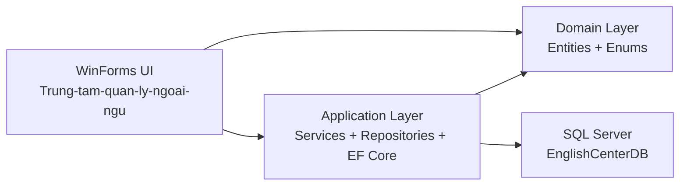
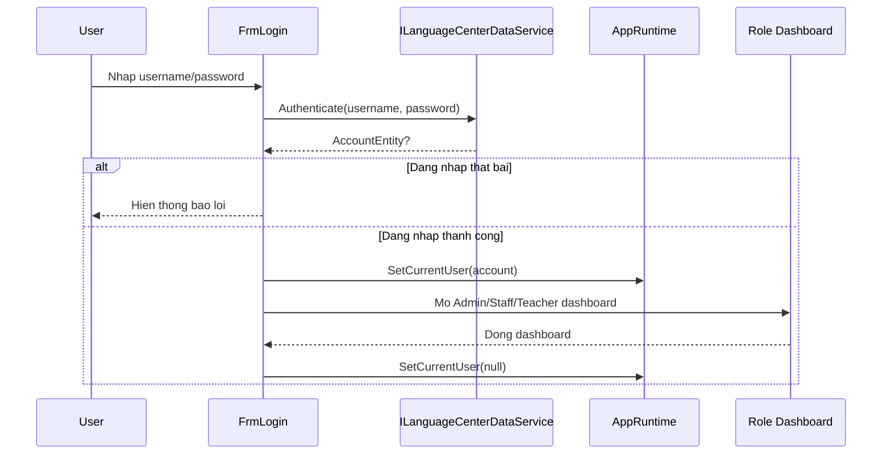

# Giai thich tong quan code base

Bo tai lieu nay duoc viet de giup doc code nhanh va giai thich du an theo dung luong chay thuc te. No khong chi liet ke file, ma con chi ra moi lop dang lam gi, vi sao form nay goi service kia, va du lieu chay nhu the nao tu luc mo app cho toi luc luu vao SQL Server.

## 1. Nhin nhanh solution

| Thu muc / project | Vai tro chinh | Nen doc khi nao |
| --- | --- | --- |
| `Trung-tam-quan-ly-ngoai-ngu` | UI WinForms, dashboard, form CRUD, form bao cao, form dang nhap | Khi muon hieu man hinh va thao tac nguoi dung |
| `TrungTamNgoaiNgu.Application` | Service, repository, EF Core, cau hinh DB, log, value mapper | Khi muon hieu nghiep vu va cach truy cap DB |
| `TrungTamNgoaiNgu.Domain` | Entity va enum dung chung | Khi muon hieu mo hinh du lieu goc |
| `docs/database-script.sql` | Script tao DB seed tai khoan mau | Khi can doi chieu voi DB that |

## 2. Kien truc tong the

Du an di theo huong 3 lop kha ro:

1. `Forms / UI` chi nhan input, bind grid, hien dialog, chuyen huong man hinh.
2. `Application` xu ly business rule, validation, map gia tri, truy cap EF Core.
3. `Domain` giu entity va enum de ca UI va Application dung chung.

Dieu quan trong nhat cua repo nay la: form khong mo `SqlConnection`, khong viet SQL truc tiep, khong thao tac bang DB thang. Form luon di qua `AppRuntime.DataService`, va `DataService` moi la cua vao duy nhat cho nghiep vu.

## 3. Luong khoi dong ung dung

File bat dau la `Trung-tam-quan-ly-ngoai-ngu/Program.cs`.

Luong chay:

1. `Main()` bat high DPI, visual styles, text rendering.
2. Tao `ILanguageCenterDataService dataService = new SqlLanguageCenterDataService()`.
3. Goi `TryInitializeRuntime(dataService)`.
4. `AppRuntime.Initialize(dataService)` gan service vao runtime toan cuc va goi `EnsureDatabaseReady()`.
5. Neu SQL loi:
   - Ghi log bang `ErrorLogger`.
   - Chuyen qua `OfflineLanguageCenterDataService`.
   - Bao nguoi dung bang `MessageBox`.
6. Dang ky xu ly unhandled exception de luon co `log.txt`.
7. Chay `Application.Run(new FrmLogin(AppRuntime.DataService))`.

Y nghia:

- App co mot "service root" duy nhat: `AppRuntime.DataService`.
- App co mot "user session" duy nhat: `AppRuntime.CurrentUser`.
- Khi SQL khong len, UI van mo duoc de demo giao dien nhờ offline service.

## 4. Luong dang nhap va chon dashboard

`FrmLogin` la cua vao cua toan bo app.

Mapping role:

- `Admin` -> `FrmAdminDashboard`
- `Staff` -> `FrmStaffDashboard`
- `Teacher` -> `FrmTeacherDashboard`

Noi hay cua cach lam nay:

- Login khong can biet chi tiet ben trong tung dashboard.
- Moi form can user hien tai chi viec doc `AppRuntime.CurrentUser`.

## 5. Mau code xuyen suot cua repo

### 5.1 Form lam viec voi `DataTable`

Rat nhieu ham service tra ve `DataTable` thay vi DTO manh kieu. Vi du:

- `GetStudentList()`
- `GetClassList()`
- `GetReceiptHistory()`
- `GetDebtList()`
- `GetTeachingClasses()`

Ly do:

- WinForms bind `DataGridView` rat nhanh voi `DataTable`.
- Khong can viet them nhieu class chi de do du lieu len bang.
- Nhieu man hinh chi can doc bang, khong can object day du.

He qua:

- Ten cot trong `DataTable` tro thanh "hop dong" giua service va form.
- Neu doi ten cot, nhieu form se vo vi dang goi truc tiep bang ten cot, vi du `"Ma hoc vien"`, `"Trang thai"`, `"EnrollmentId"`.

### 5.2 Khi can sua chi tiet, form goi `GetById()`

Mau lap lai rat nhieu:

1. Tai danh sach bang `GetXxxList()`.
2. Chon 1 dong trong grid.
3. Lay ID tu cot dau.
4. Goi `GetXxxById(id)` de lay full entity.
5. Do du lieu len editor.
6. Tao entity moi tu input.
7. Goi `SaveXxx(entity)`.

Mau nay xuat hien o:

- `FrmStudentManagement`
- `FrmTeacherManagement`
- `FrmCourseManagement`
- `FrmClassManagement`

### 5.3 Runtime toan cuc

`Trung-tam-quan-ly-ngoai-ngu/Core/AppRuntime.cs` giu 2 thong tin song song:

- `DataService`: service goc cua app
- `CurrentUser`: tai khoan dang dang nhap

Dieu nay giam viec dependency injection phuc tap trong WinForms, doi lai app phu thuoc vao singleton runtime.

### 5.4 Theme va helper UI

Hai helper xuyen suot:

- `AppTheme`: mau sac, font, style grid, localize text cot/grid.
- `FormHostHelpers`: DPI scaling, split container an toan, mo child form, logout, ui trace log.

Gan nhu dashboard va form lon nao cung co cap ham:

- `ConfigureView()` / `ApplyShellStyling()`
- `WireEvents()`
- `ApplyResponsiveLayout()` hoac `ConfigureResponsiveLayout()`

No cho thay repo duoc to chuc theo "UI script pattern": moi form tu setup giao dien, bind event, load data, roi xu ly responsive.

## 6. Cac luong nghiep vu lon trong du an

### 6.1 Staff CRUD va van hanh

- Quan ly hoc vien
- Quan ly giao vien
- Quan ly khoa hoc
- Quan ly lop hoc
- Ghi danh
- Thu hoc phi / bien lai
- Theo doi cong no

### 6.2 Teacher workflow

- Xem lop dang day
- Xem danh sach hoc vien theo lop
- Diem danh
- Nhap diem

### 6.3 Admin workflow

- Dashboard tong hop
- Giam sat he thong
- Tai khoan va phan quyen
- Bao cao / thong ke / xuat file

## 7. Thu tu nen doc source neu muon hieu nhanh

Neu muon doc code theo thu tu it bi roi, nen di theo chuoi nay:

1. `Trung-tam-quan-ly-ngoai-ngu/Program.cs`
2. `Trung-tam-quan-ly-ngoai-ngu/Core/AppRuntime.cs`
3. `TrungTamNgoaiNgu.Application/Contracts/ILanguageCenterDataService.cs`
4. `TrungTamNgoaiNgu.Application/Services/SqlLanguageCenterDataService.cs`
5. `TrungTamNgoaiNgu.Application/Data/LanguageCenterDbContext.cs`
6. `TrungTamNgoaiNgu.Domain/Entities/*.cs`
7. `Trung-tam-quan-ly-ngoai-ngu/Forms/Common/FrmLogin.cs`
8. Dashboard theo role:
   - `Forms/Admin/FrmAdminDashboard.cs`
   - `Forms/Staff/FrmStaffDashboard.cs`
   - `Forms/Teacher/FrmTeacherDashboard.cs`
9. Form nghiep vu lon:
   - `FrmEnrollment.cs`
   - `FrmTuitionReceipt.cs`
   - `FrmAttendance.cs`
   - `FrmScoreEntry.cs`
   - `FrmAdminReports.cs`

## 8. Cac diem can nho khi giai thich do an

### 8.1 Diem manh

- Co tach lop ro rang giua UI, nghiep vu, va du lieu.
- Co fallback offline de demo du UI khi SQL co van de.
- Co log loi trung tam (`log.txt`) va `ui-trace.log`.
- Co them phan responsive layout cho WinForms, khong chi la form co dinh.
- Co xuat Excel/PDF tu bang du lieu.

### 8.2 Diem can noi ro khi bao ve

- Nhieu man hinh dung `DataTable`, nen ten cot la rang buoc manh giua service va UI.
- App chua dung dependency injection container; no dung `AppRuntime` singleton.
- Nhieu chuoi display/label duoc gan thu cong trong tung form, nghia la localization chua tach thanh resource hoan chinh.
- `OfflineLanguageCenterDataService` khong thay SQL that, no chi dung de demo giao dien va flow co ban.

## 9. Muc luc cac file giai thich con lai

- `01-domain-va-du-lieu.md`: mo hinh entity, quan he, mapping EF Core, soft-delete, seed.
- `02-application-va-nghiep-vu.md`: service, repository, auth, validation, enrollment, receipt, attendance, score, report.
- `03-ui-admin-va-ha-tang-ui.md`: login, admin dashboard, reports, account management, helper UI.
- `04-ui-staff-teacher-va-luong-nghiep-vu.md`: staff CRUD, enrollment, tuition receipt, debt, teacher dashboard, attendance, score.
