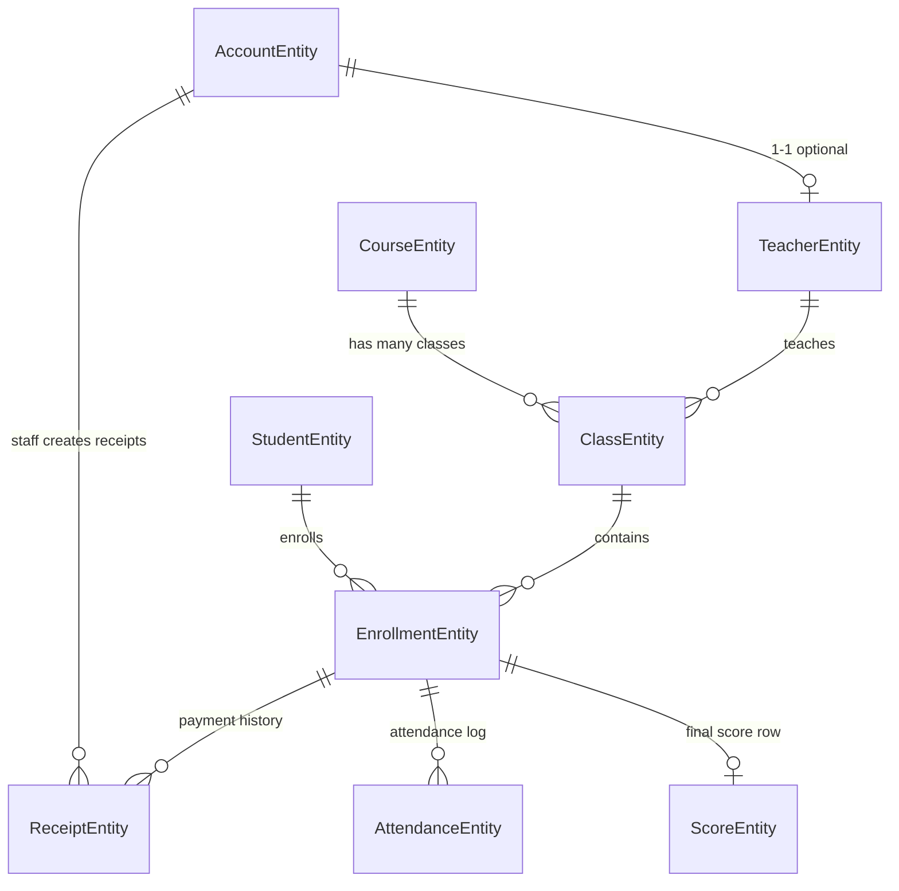

   # Domain va du lieu

File nay tap trung vao cau truc data model cua du an: entity nao ton tai, quan he giua chung, EF Core map vao bang nao, rang buoc nao dang duoc enforce trong code.

## 1. Toan bo entity trong `TrungTamNgoaiNgu.Domain`

| Entity | Y nghia | Thuoc tinh quan trong |
| --- | --- | --- |
| `AccountEntity` | Tai khoan dang nhap he thong | `Username`, `PasswordHash`, `Role`, `Status`, `TeacherProfile` |
| `StudentEntity` | Hoc vien | `FullName`, `BirthDate`, `Phone`, `Email`, `Status`, `AvatarPath` |
| `TeacherEntity` | Giao vien | `FullName`, `Phone`, `Email`, `Specialization`, `AccountId`, `Status` |
| `CourseEntity` | Khoa hoc | `Name`, `Description`, `TuitionFee`, `Status` |
| `ClassEntity` | Lop hoc cu the cua 1 khoa hoc | `CourseId`, `TeacherId`, `Schedule`, `MaxStudents`, `Status` |
| `EnrollmentEntity` | Ghi danh cua 1 hoc vien vao 1 lop | `StudentId`, `ClassId`, `EnrollDate`, `Status`, `Note` |
| `ReceiptEntity` | Bien lai thu hoc phi | `EnrollmentId`, `AmountPaid`, `PayDate`, `PaymentMethod`, `CreatedByStaffId` |
| `AttendanceEntity` | Ban ghi diem danh theo buoi | `EnrollmentId`, `AttendanceDate`, `Status`, `Note` |
| `ScoreEntity` | Bang diem tong hop theo ghi danh | `EnrollmentId`, `MidtermScore`, `FinalScore`, `Note` |

Enum dung chung:

- `AccountRole`: `Admin`, `Staff`, `Teacher`
- `AccountStatus`: `Active`, `Inactive`, `Locked`

## 2. Quan he giua cac entity

Giai thich bang ngon ngu nghiep vu:

- 1 `TeacherEntity` co the lien ket voi 1 `AccountEntity`, nhung khong bat buoc. Nghia la co giao vien co ho so nhung chua co tai khoan login.
- 1 `CourseEntity` co nhieu `ClassEntity`.
- 1 `ClassEntity` thuoc dung 1 khoa hoc va dung 1 giao vien.
- 1 `StudentEntity` co the co nhieu lan ghi danh, moi lan la 1 `EnrollmentEntity`.
- 1 `EnrollmentEntity` co the co nhieu `ReceiptEntity` vi hoc phi co the thu nhieu dot.
- 1 `EnrollmentEntity` co nhieu `AttendanceEntity`, moi buoi hoc 1 ban ghi.
- 1 `EnrollmentEntity` co toi da 1 `ScoreEntity`.

## 3. EF Core mapping trong `LanguageCenterDbContext`

`TrungTamNgoaiNgu.Application/Data/LanguageCenterDbContext.cs` la noi map entity sang bang SQL Server.

### 3.1 Bang `Accounts`

Mapping:

- PK: `Id`
- Unique index: `Username`, `Email`, `Phone`
- `Role` va `Status` duoc luu duoi dang string trong SQL
- `CreatedAt` mac dinh `SYSUTCDATETIME()`

Y nghia:

- DB khong luu so enum, no luu text de de doc va de debug.
- Unique index co filter `[IsDeleted] = 0`, nghia la xoa mem khong giai phong ngay gia tri unique cu.

### 3.2 Bang `Teachers`

Diem can nho:

- `AccountId` la optional.
- `AccountId` co unique index khi khong null.
- Quan he voi `Accounts` la 1-1, `OnDelete(DeleteBehavior.SetNull)`.

Nghia la:

- Xoa tai khoan giao vien khong bat buoc xoa ho so giao vien.
- Chuyen trang thai "teacher co tai khoan" thanh "teacher mat lien ket account".

### 3.3 Bang `Classes`

Diem can nho:

- Co FK toi `CourseId` va `TeacherId`
- `OnDelete(DeleteBehavior.Restrict)` cho ca 2 FK
- `MaxStudents` khong map tinh nang DB dac biet, nhung service co logic kiem soat si so

Nghia la:

- Lop hoc la data trung tam cua nhieu flow: ghi danh, lich hoc, diem danh, nhap diem, bao cao.

### 3.4 Bang `Enrollments`

Rang buoc quan trong nhat:

- Unique composite index: `(StudentId, ClassId)` voi filter `[IsDeleted] = 0`

Nghia la:

- Mot hoc vien khong duoc ghi danh 2 lan vao cung 1 lop neu ban ghi cu chua bi xoa mem.
- Logic nay duoc bao ve ca o service va o database.

### 3.5 Bang `Receipts`

Diem can nho:

- `AmountPaid` la `decimal(18,2)`
- `CreatedByStaffId` FK toi `Accounts`, `OnDelete(SetNull)`
- `EnrollmentId` FK toi `Enrollments`, `OnDelete(Restrict)`

Nghia la:

- Bien lai bat buoc thuoc 1 ghi danh.
- Neu staff nghi viec hay tai khoan bi xoa, bien lai van ton tai, chi mat lien ket nguoi tao.

### 3.6 Bang `Attendances`

Rang buoc:

- Unique index: `(EnrollmentId, AttendanceDate)`

Nghia la:

- 1 hoc vien trong 1 buoi hoc chi co 1 dong diem danh.
- `SaveAttendance()` trong service vi the duoc viet theo mau upsert.

### 3.7 Bang `Scores`

Rang buoc:

- Unique index: `EnrollmentId`
- Quan he 1-1 voi `EnrollmentEntity`

Nghia la:

- Bang diem hien tai la 1 ban ghi tong hop cho moi ghi danh, chua tach diem nghe/noi/doc/viet.

## 4. Quy uoc ma ID

Repo nay khong dung identity int. No dung ma tu sinh theo prefix.

| Prefix | Doi tuong |
| --- | --- |
| `ACC` | Account |
| `HV` | Student |
| `GV` | Teacher |
| `KH` | Course |
| `LP` | Class |
| `GD` | Enrollment |
| `PT` | Receipt |
| `DD` | Attendance |
| `DS` | Score |

Ham tao ma nam trong `SqlLanguageCenterDataService.GetNextCode()` va `SqlAccountRepository.GetNextCode()`.

Co che:

1. Lay toan bo ID hien co.
2. Loc nhung ID bat dau bang prefix.
3. Cat phan so o cuoi.
4. Tim max.
5. Cong 1.
6. Format thanh `PREFIX000`.

Vi du:

- `ACC001`
- `HV006`
- `LP023`

## 5. Soft-delete

Phan lon entity co truong:

- `IsDeleted`
- `CreatedAt`
- `UpdatedAt`

Xoa du lieu trong app da so la xoa mem:

- `Student`
- `Teacher`
- `Course`
- `Class`
- `Account`
- `Enrollment`
- `Receipt`

Service co helper generic `SoftDeleteEntity<TEntity>()` de tim entity theo `Id`, dat `IsDeleted = true`, roi `SaveChanges()`.

Tac dung:

- UI an du lieu da xoa.
- Unique index co filter van tranh va cham voi ban ghi chua xoa.
- Bao cao co the chon bo qua du lieu da xoa de tranh sai so.

## 6. Gia tri canonical va gia tri display

Repo nay co 2 lop gia tri cho status/payment:

1. Gia tri canonical trong code/DB, thuong la tieng Anh:
   - `Active`
   - `Paused`
   - `Completed`
   - `Open`
   - `InProgress`
   - `Cash`
   - `BankTransfer`
2. Gia tri display tren UI, thuong la tieng Viet:
   - `Dang hoc`
   - `Bao luu`
   - `Dang mo`
   - `Tien mat`
   - `Chuyen khoan`

Lop map nam o `TrungTamNgoaiNgu.Application/Localization/LanguageCenterValueMapper.cs`.

Y nghia:

- UI co the dua gia tri da Viet hoa / da localize vao service.
- Service normalize lai truoc khi luu.
- Khi load entity/detail, service co the doi nguoc ve gia tri display.

Vi du:

- `SaveStudent()` se doi `Dang hoc` thanh `Active` truoc khi luu.
- `GetStudentById()` se doi `Active` thanh `Dang hoc` truoc khi tra ve UI.

## 7. Avatar, log, va file phu tro

`TrungTamNgoaiNgu.Application/Infrastructure/AppPaths.cs` quy dinh:

- `BaseDirectory`
- `log.txt`
- `Images/Students`
- `Images/Teachers`

Avatar duoc luu theo quy uoc:

- Ten file: `{entityId}_{yyyyMMddHHmmss}.{ext}`
- Thu muc:
  - `Images/Students`
  - `Images/Teachers`

Nghia la:

- DB chi luu `AvatarPath` dang tuong doi.
- UI can goi `ResolveAbsoluteImagePath()` de preview.

## 8. Seed data mau

Khi DB rong hoan toan, `SqlLanguageCenterDataService.SeedData()` se seed:

- 3 account: `admin`, `staff`, `teacher`
- teacher, course, class, student, enrollment, receipt, attendance, score mau

Seed nay co 2 muc dich:

1. Vua test logic SQL.
2. Vua cho dashboard/report co du lieu de demo ngay.

Dieu kien seed:

- Tat ca bang chinh deu phai rong

Neu chi 1 bang co du lieu, service se khong seed nua. Cac bang phu thuoc vao DB hien co luc do.

## 9. Nuance quan trong khi doc data model

### 9.1 `StudentEntity.Email` la optional trong domain, nhung UI hoc vien bat buoc email

Domain:

- `Email` co the null

UI `FrmStudentManagement`:

- `ValidateEditor()` bat buoc nhap email

Nghia la:

- Lop UI dang stricter hon domain model.

### 9.2 `TeacherEntity.AccountId` optional

Co nghia:

- Giao vien co the ton tai ma khong dang nhap duoc he thong.
- Teacher dashboard chi hoat dong day du voi giao vien nao co `AccountId` khop `AppRuntime.CurrentUser.Id`.

### 9.3 `ScoreEntity` hien tai la bang diem tong hop

Ten field:

- `MidtermScore`
- `FinalScore`

Khong co:

- Listening
- Speaking
- Reading
- Writing

Neu can mo rong, can doi ca:

- Domain
- `DbContext`
- `GetScoreList()`
- `SaveScores()`
- `FrmScoreEntry`

## 10. File nen doc tiep sau file nay

Sau khi hieu model va DB, nen doc tiep:

- `02-application-va-nghiep-vu.md`

Vi lop service moi la noi dung that su "lam viec" voi cac entity tren.
