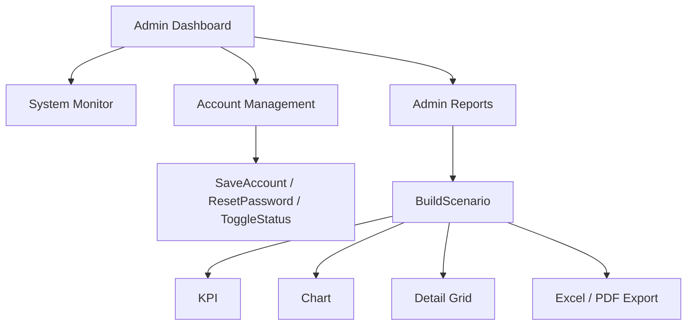

# UI admin va ha tang UI dung chung

File nay giai thich nhom code phia WinForms dung chung va nhom man hinh admin. Neu `02-application-va-nghiep-vu.md` tra loi "du lieu va business di ra sao", thi file nay tra loi "man hinh duoc lap trinh nhu the nao".

## 1. Ha tang UI dung chung

## 1.1 `AppTheme`

File: `Trung-tam-quan-ly-ngoai-ngu/Core/AppTheme.cs`

Vai tro:

- khai bao mau chu dao, font, accent
- style button, group box, panel, grid
- localize tieu de cot va gia tri trong `DataGridView`
- bat `DataError` handler de grid khong vang app

Diem hay:

- `StyleGrid()` khong chi set mau, no con dang ky event:
  - `DataBindingComplete`
  - `CellFormatting`
  - `DataError`
- `GridHeaderText` va `GridCellText` la 2 bang mapping de doi display text.

Nuance:

- `RoundPanelCorners()` hien dang la no-op, nghia la helper ton tai nhung chua ve bo goc that.

## 1.2 `FormHostHelpers`

File: `Trung-tam-quan-ly-ngoai-ngu/Forms/Common/BaseForms.cs`

Day la helper rat quan trong cho shell:

- `ConfigureModuleSurface()`: form nghiep vu vua
- `ConfigureShellSurface()`: dashboard full screen
- `ConfigureDialogSurface()`: dialog
- `OpenChildForm()`: mo form con trong panel host
- `OpenLoginAndClose()`: logout
- `EnableOptimizedRendering()`: bat double buffer
- `ScaleForDpi()`, `ScaleSize()`, `ScalePadding()`
- `ApplyResponsiveSplit()`, `ApplySafeSplitterDistance()`
- `LogUi()`: ghi `logs/ui-trace.log`

Y nghia:

- Cac dashboard Admin/Teacher/Staff deu dung chung cach host child form.
- App co y thuc kha ro ve DPI va resize, khong chi drag-tha control.

## 1.3 `UiHelpers`

File: `Trung-tam-quan-ly-ngoai-ngu/Core/UiHelpers.cs`

Vai tro:

- factory tao panel, label, textbox, combo, date picker, button, grid
- tao chart
- tao metric card
- show child form

Day la helper phuc vu nhung form co xu huong build UI bang code thay vi chi designer.

## 1.4 `ExportFileHelper`

File: `Trung-tam-quan-ly-ngoai-ngu/Core/ExportFileHelper.cs`

No co 2 viec:

- `ExportDataTableToExcel()` bang `ClosedXML`
- `ExportDataTableToPdf()` bang `PdfSharp`

Diem can nho:

- Input la `DataTable`, nen bat ky bang nao service tra ra cung co the xuat.
- PDF export hien tai la kieu line-based, phu hop demo/report don gian hon la in layout dep.

## 1.5 Dialog dung chung

Thu muc: `Forms/Dialogs`

Vai tro:

- `FrmConfirmDialog`: xac nhan xoa mem
- `FrmStatusDialog`: thong bao / placeholder
- `FrmImagePreviewDialog`: xem hinh

Day la cach repo giam viec dung `MessageBox` don thuan trong moi tinh huong.

## 2. Man hinh dang nhap `FrmLogin`

File: `Trung-tam-quan-ly-ngoai-ngu/Forms/Common/FrmLogin.cs`

### 2.1 Viec constructor lam

Constructor khong chi `InitializeComponent()`, no con:

- nhan `ILanguageCenterDataService`
- apply theme
- setup login logo/background
- bind `AcceptButton`, `CancelButton`
- bind event cho login, show password, exit, forgot password
- load image neu co
- setup responsive layout theo kich thuoc man hinh

### 2.2 `HandleLogin()`

Buoc:

1. Clear error.
2. Bat buoc username/password khong rong.
3. Goi `_dataService.Authenticate()`.
4. Neu sai -> hien panel loi.
5. Neu dung:
   - `AppRuntime.SetCurrentUser(account)`
   - switch theo `AccountRole`
   - mo dashboard bang `ShowDialog()`
   - khi dashboard dong -> xoa session user

### 2.3 Vi sao dashboard mo bang `ShowDialog()`

No giu login form song song trong nen:

- login `Hide()`
- dashboard dong xong -> login `Show()` lai

Nghia la:

- user logout xong co the quay lai login ma khong can restart app.

## 3. `FrmAdminDashboard`

File: `Forms/Admin/FrmAdminDashboard.cs`

Vai tro:

- shell cua admin
- host cac module con trong `pnlContentHostAdmin`
- hien dashboard tong hop mac dinh

Luong setup:

1. `ConfigureShellSurface()`
2. `ApplyLocalizedText()`
3. `ApplyShellStyling()`
4. `ConfigureResponsiveLayout()`
5. `BindDashboardData()`
6. `WireEvents()`
7. `ShowDashboardHome()`

### `BindDashboardData()`

Lay:

- `GetAdminDashboardStats()`
- `GetAccounts().Count`
- `GetAdminWarnings()`
- `GetMonitorActivity()`

Nghia la:

- dashboard home cua admin la read-only overview
- thao tac nghiep vu sau do chuyen sang module con

### `OpenModule()`

Su dung `FormHostHelpers.OpenChildForm()` de dat form con vao panel host.

Mo hinh nay lap lai o dashboard teacher, va ve ban chat cung nen duoc staff dashboard ap dung.

## 4. `FrmSystemMonitor` va `FrmAccessMatrix`

### `FrmSystemMonitor`

Dung cho admin xem:

- activity summary
- detailed log
- mot vai KPI tong hop

Nguon du lieu:

- `GetMonitorActivity()`
- `GetMonitorDetailedLog()`

Thuc chat day la form monitor read-only duoc service feed bang `DataTable`.

### `FrmAccessMatrix`

Nguon du lieu:

- `GetAccessMatrix()`

No dung de giai thich quyen cua `Admin`, `Staff`, `Teacher` bang bang ma tran chuc nang.

## 5. `FrmAccountManagement`

File: `Forms/Admin/FrmAccountManagement.cs`

Day la form phuc tap nhat phan admin sau reports.

## 5.1 Kien truc noi bo cua form

Form khong bind grid truc tiep. Thay vao do no dung:

- `_accounts`: `List<AccountRecord>`
- `_accountCards`: map `accountId -> Panel`
- `_selectedAccount`
- `_creatingAccount`

Nghia la:

- UI danh sach account duoc render thanh card, khong phai `DataGridView`.

## 5.2 `AccountRecord` la projection cho UI

Tai sao can `AccountRecord` thay vi bind `AccountEntity` truc tiep?

Vi UI can:

- `Role` dang string de do vao badge
- `Status` dang display text de highlight
- du lieu da "lam phang" phu hop card view

`AccountRecord.FromEntity()` map:

- `Role.ToString()`
- `Status == Active ? "Hoat dong" : "Khoa"`

## 5.3 Luong tai danh sach

1. `SeedAccounts()` goi `_dataService.GetAccounts()`
2. Convert thanh `_accounts`
3. `ApplyFilters()`
4. `RenderAccountCards()`
5. `CreateAccountCard()` tao panel + badge + initials + event click

## 5.4 Luong tao / sua / doi trang thai

### Tao moi

`StartCreatingAccount()`:

- xoa detail cu
- goi `GetNextAccountId()`
- set `_creatingAccount = true`

### Luu

`SaveCurrentAccountPersisted()`:

1. `ValidateInputs()`
2. Xac dinh `accountId`
3. Tao `AccountEntity` tu input
4. `PasswordHash = string.Empty`
5. Goi `_dataService.SaveAccount()`
6. Reload list

Nuance:

- Service thay `PasswordHash` rong bang mat khau mac dinh `123456`
- Nghia la tao account moi khong can nhap password o UI admin

### Reset password

`ResetSelectedAccountPassword()`:

- goi `_dataService.ResetAccountPassword(_selectedAccount.AccountId, "123456")`

### Toggle status

`ToggleSelectedAccountStatus()`:

- goi `_dataService.ToggleAccountStatus(accountId)`
- reload list

## 5.5 Highlight quyen

Form co 3 panel:

- Admin
- Staff
- Teacher

`HighlightPermissionRole()` doi mau panel theo role dang chon. Day la cach UI cho admin "nhin" role hien tai ngay trong luc sua account.

## 6. `FrmAdminReports`

File: `Forms/Admin/FrmAdminReports.cs`

Day la form tong hop giua:

- service report
- chart
- KPI
- export
- responsive layout

No xung dang duoc giai thich ky vi la man hinh "thuyet trinh" cua du an.

## 6.1 Tu duy thiet ke cua form

Form nay khong tu query SQL truc tiep. No dong vai tro "UI orchestration":

1. Lay report type + date range
2. Goi service lay detail + point series
3. Build `ReportScenario`
4. Bind scenario vao tat ca widget:
   - KPI
   - chart
   - highlight card
   - distribution card
   - detail grid

`ReportScenario` la object tam rat quan trong.

No gom:

- text cho 4 KPI
- chart points
- target points
- detail table
- phan tram progress
- top 3 phan bo

Y nghia:

- form khong can nho qua nhieu bien roi rac
- moi lan doi report type chi can build lai 1 scenario

## 6.2 `ApplyReportView()`

Buoc:

1. Kiem tra from-date <= to-date
2. `GetSelectedReportType()`
3. `BuildScenario(type, from, to)`
4. `BindScenarioToUi()`
5. `ApplyReportTypeIcons()`
6. Cap nhat label phien xem bao cao

## 6.3 `BuildScenario()`

No chon logic theo 3 report:

- `Doanh thu tong hop`
- `Tuyen sinh`
- `Cong no`

Moi nhanh deu:

1. Lay `stats = _dataService.GetAdminDashboardStats()`
2. Lay `detailTable = _dataService.GetReportDetail(...)`
3. Lay `chartPoints`
4. Tao `targetPoints`
5. Tao `distributions`
6. Nap vao `ReportScenario`

No chinh la noi UI "dich" du lieu goc thanh ngon ngu trinh bay.

## 6.4 Chart

`BindSeries()` tao 2 series:

- `Thuc te` = column
- `Muc tieu` = line

Nguon chart:

- doanh thu -> `GetMonthlyRevenue()`
- tuyen sinh -> `GetMonthlyEnrollmentCounts()`
- cong no -> `BuildMonthlySeriesFromTable(detailTable, "Ngay doi soat", "Con no")`

`EnsureSeriesHasPoints()` con them du lieu 0 neu khong co diem nao, de chart khong rong.

## 6.5 Distribution card

`BuildDistributions()` lay top 3 nhom va tinh phan tram:

- doanh thu -> nhom theo khoa hoc trong `GetClassList()`
- tuyen sinh -> nhom theo cot `Khoa hoc` trong detail table
- cong no -> nhom theo `GetDebtList()`

No khong phai pie chart that su, ma la 3 label/tile ty le.

## 6.6 Export

Button:

- `btnExportReportCsv` goi `ExportCurrentReportExcel()`
- `btnPrintReport` goi `ExportCurrentReportPdf()`

Nuance:

- Ten button hien thi "CSV", nhung code that xuat `xlsx`.
- Ham `BuildCsv()` ton tai nhung hien tai khong duoc dung trong flow export chinh.

Khi giai thich, co the noi:

- UI label dang huong "xuat du lieu", nhung implementation hien tai uu tien Excel/PDF.

## 7. Responsive layout trong admin forms

Ca `FrmAdminDashboard`, `FrmSystemMonitor`, `FrmAdminReports`, `FrmAccountManagement` deu co mot mau lap lai:

1. Constructor setup base view
2. `Resize += ...`
3. `ApplyResponsiveLayout()` hoac `ApplyResponsiveBreakpoints()`
4. `SplitContainer` doi orientation khi hep
5. `TableLayoutPanel` doi so cot/kich thuoc khi hep

Day la diem rat nen nhan manh neu ban can giai thich "phan giao dien co dau tu gi":

- khong chi co designer keo tha
- team da viet logic responsive bang code cho WinForms

## 8. Mau event-flow cua admin UI

## 9. Cac diem can noi ro khi bao ve man admin

- Admin dashboard chu yeu read-only, nhin tong quan.
- Account management la noi admin thuc su thao tac vao account.
- Reports la man trinh dien, no tong hop du lieu tu service thanh KPI + chart + grid.
- Monitor va access matrix la hai man "giai thich he thong" rat hop de demo quyen va quan sat.
