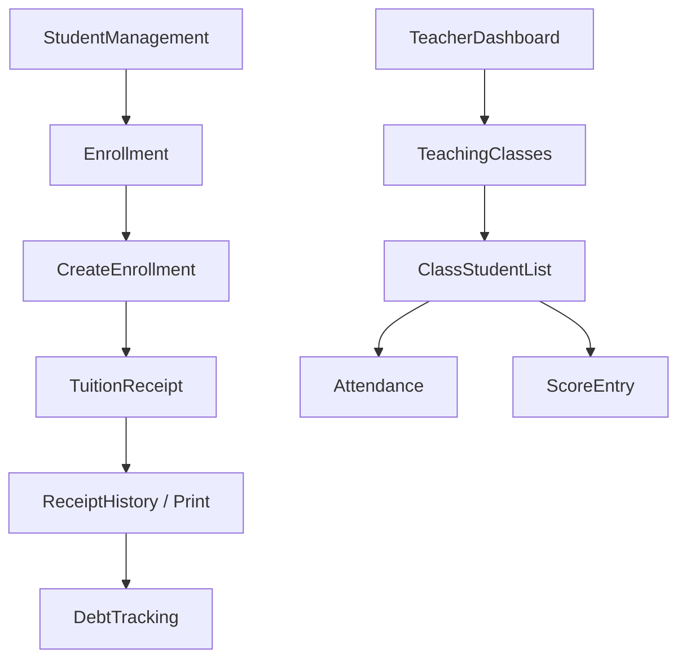

# UI staff, teacher va cac luong nghiep vu

File nay giai thich phan "chay viec" nhieu nhat cua he thong: staff van hanh trung tam va teacher xu ly lop hoc.

## 1. Staff dashboard la cua vao cua khoi van hanh

File: `Forms/Staff/FrmStaffDashboard.cs`

Module staff duoc mo tu sidebar:

- `FrmStudentManagement`
- `FrmTeacherManagement`
- `FrmCourseManagement`
- `FrmClassManagement`
- `FrmEnrollment`
- `FrmTuitionReceipt`
- `FrmDebtTracking`

Dashboard home staff bind:

- `GetStaffDashboardStats()`
- `GetDebtList()`
- `GetRecentReceipts()`

Tu duy tong the:

- Dashboard chi tong hop nhanh
- Moi nghiep vu chinh tach thanh 1 form rieng

## 2. Mau CRUD chung cua nhom staff form

Gan nhu 4 form:

- `FrmStudentManagement`
- `FrmTeacherManagement`
- `FrmCourseManagement`
- `FrmClassManagement`

deu lap lai cung 1 mau:

1. `ConfigureView()`
2. `LoadXxx()`
3. `WireEvents()`
4. Grid `SelectionChanged` -> `PopulateDetailFromSelection()`
5. `Create` -> set ma moi
6. `Save` -> tao entity tu editor -> goi service
7. `Delete` -> xoa mem

Mau nay rat de giai thich trong do an vi no cho thay app co consistency.

## 3. `FrmStudentManagement`

### 3.1 Form nay quan ly gi

- danh sach hoc vien
- thong tin chi tiet
- avatar
- trang thai hoc vien
- mo man ghi danh tu hoc vien da chon

### 3.2 Luong load data

1. `LoadStudents(keyword, status)` goi `GetStudentList()`
2. Grid bind `DataTable`
3. Chon dong dau tien
4. `PopulateDetailFromSelection()`
5. Goi `GetStudentById(studentId)` de lay full entity

Day la ly do service vua co `GetStudentList()` vua co `GetStudentById()`.

### 3.3 Save hoc vien

`SaveCurrentStudent()`:

1. `ValidateEditor()`
2. Tao `StudentEntity` tu input
3. `AppRuntime.DataService.SaveStudent(student)`
4. Neu co avatar moi:
   - `SaveStudentAvatar(student.Id, sourcePath)`
   - gan `AvatarPath` moi
   - goi `SaveStudent()` lan 2 de cap nhat entity
5. Reload list
6. Focus lai hoc vien vua luu

Nuance:

- Save avatar va save entity la 2 buoc tach rieng.
- UI bat buoc email hop le, du domain cho phep email null.

### 3.4 Avatar flow

`ChooseAvatar()` chi chon file va nho `_pendingAvatarSourcePath`.

Anh chi duoc copy vao thu muc `Images/Students` sau khi user bam `Save`.

Dieu nay dung vi:

- tranh copy file rac neu user chon xong roi bo
- chi luu avatar cho hoc vien da co `Id`

### 3.5 Mo ghi danh tu hoc vien

Nut `btnOpenEnrollment` mo:

- `new FrmEnrollment(studentId, null)`

Nghia la:

- form ghi danh co the duoc preselect hoc vien

## 4. `FrmTeacherManagement`

Form nay rat giong `FrmStudentManagement`, nhung co them:

- `AccountId`
- `Specialization`
- `Gender`
- lien ket giao vien voi tai khoan login

Nuance:

- Giao vien co the ton tai ma khong can account.
- Neu muon teacher login duoc vao dashboard, can co `TeacherEntity.AccountId` map toi `AccountEntity.Id`.

## 5. `FrmCourseManagement`

### Vai tro

- CRUD khoa hoc
- xem cac lop thuoc khoa hoc dang chon

### Diem can nho

- `Description` thuc chat gom 2 lop thong tin: `Level | Mo ta`
- `BuildCourseDescription()` va `ParseCourseDescription()` la cap helper doi qua doi lai giua UI va DB
- `StartCreateCourse()` set grid lop lien quan thanh rong bang `GetClassList(courseId: "__empty__")`

Nghia la:

- Course model trong DB chua co field `Level` rieng
- UI dang "ghep" level vao description

## 6. `FrmClassManagement`

### Vai tro

- CRUD lop hoc
- xem hoc vien trong lop
- xem lich hoc suy dien
- mo man ghi danh tu lop dang chon

### Save lop

`SaveCurrentClass()`:

1. `ValidateEditor(out courseId, out teacherId, out maxStudents)`
2. Tao `ClassEntity`
3. Goi `SaveClass(entity)`
4. Reload list
5. Focus lai lop vua luu

### Resolve course va teacher

UI cho nhap:

- `KH001`
- `English Foundation`
- `KH001 - English Foundation`

`ResolveCourseId()` va `ResolveTeacherId()` se tim ID chuan.

Y nghia:

- form linh hoat khi user copy/paste text
- service van la lop quyet dinh ID cuoi cung

### 2 grid phu trong detail

Khi chon lop, form load them:

- `GetClassStudents(entity.Id)`
- `GetSessions(entity.Id)`

No giup man class management tro thanh man "tong hop lop hoc", khong chi la CRUD.

## 7. `FrmEnrollment`

Day la form trung tam cua khoi staff.

### 7.1 No gom 3 vung logic

1. Chon hoc vien
2. Chon lop con cho
3. Tong hop hoc phi tam tinh va tao ghi danh

### 7.2 Luong tai data

`LoadData()`:

1. `GetEnrollmentStudents()`
2. `BindCourseFilter()` tu `GetCourseList()`
3. `LoadClassData()` -> `GetEnrollmentClasses(courseId, true)`
4. Neu co student/class preselected thi focus vao dong do

`onlyAvailable = true` nghia la grid lop chi hien lop con cho.

### 7.3 Tinh hoc phi tam tinh

`RecalculateFinalFee()`:

- `FinalFee = max(0, OriginalFee - Discount)`

Nhung nho:

- Day chi la tinh tren UI
- Khong co field discount that trong DB

### 7.4 Tao ghi danh

`CreateEnrollment()`:

1. Validate da chon hoc vien + lop
2. Check trung ghi danh
3. Check het cho
4. Neu co discount -> noi vao `note`
5. Goi `AppRuntime.DataService.CreateEnrollment(...)`
6. Luu `_currentEnrollmentId`
7. Bat nut thu hoc phi
8. Mo `FrmTuitionReceipt`

Nghia la:

- Flow thiet ke la: ghi danh xong thu hoc phi ngay

## 8. `FrmTuitionReceipt`

Day la form thu hoc phi / in bien lai.

### 8.1 Cac cach vao form

- Tu `FrmEnrollment` voi `enrollmentId`
- Tu `FrmDebtTracking` voi `enrollmentId` va `studentId`
- Mo truc tiep va tu nhap `studentId`

### 8.2 Context load

`LoadEnrollmentContext(enrollmentId)`:

- Neu co enrollmentId -> `GetEnrollmentReceiptContext(enrollmentId)`
- Neu khong co ma co student code -> `TryResolveContextFromStudentCode()`

Field tren man hinh duoc do bang context:

- ma hoc vien
- ten hoc vien
- lop
- khoa hoc
- hoc phi
- cong no

### 8.3 Save receipt

`SaveReceipt(openPreview)`:

1. `ValidateReceipt()`
2. Goi `SaveReceipt(null, enrollmentId, amount, DateTime.Today, method, note, AppRuntime.CurrentUser?.Id)`
3. Luu `_lastReceiptId`
4. Goi `GetReceiptPrintInfo(receipt.Id)`
5. Reload context va history
6. Neu `openPreview` -> mo print preview

### 8.4 Receipt history

Grid lich su nhan tu:

- `GetReceiptHistory(enrollmentId, studentId)`

No giup staff xem tong cac dot thu truoc do.

### 8.5 Print

`PrintReceiptPreview()` khong xuat file ngay. No ve text len `Graphics`:

- so bien lai
- hoc vien
- lop
- khoa hoc
- hoc phi
- da thu dot nay
- tong da thu
- con lai
- nhan vien thu

Nghia la:

- bien lai hien tai la layout in co ban, du cho demo flow nghiep vu

## 9. `FrmDebtTracking`

### Vai tro

- loc cong no theo khoa hoc, lop, khoang ngay
- tinh tong no
- mo lai man thu hoc phi cho hoc vien con no
- xuat Excel/PDF

### Nguon data

- `GetDebtList(courseName, className, fromDate, toDate)`

### Summary cards

`UpdateSummaryCards()` tinh tu chinh `DataTable` da bind:

- tong ho so cong no
- tong tien con no
- so ho so `Qua han` hoac `Sap den han`

Y nghia:

- form khong query them; no tai su dung du lieu da co tren grid

### Thu tiep tu danh sach cong no

`OpenReceiptFromDebt()`:

1. Lay `studentId` va `EnrollmentId` tu dong dang chon
2. Mo `FrmTuitionReceipt(enrollmentId, studentId)`
3. Dong form receipt xong -> reload cong no

Flow nay rat hop ly ve mat nghiep vu: xem no -> thu tien -> cap nhat no.

## 10. Teacher dashboard

File: `Forms/Teacher/FrmTeacherDashboard.cs`

### 10.1 Vai tro

- shell cua teacher
- host:
  - `FrmTeachingClasses`
  - `FrmClassStudentList`
  - `FrmAttendance`
  - `FrmScoreEntry`

### 10.2 Bind du lieu home

`BindDashboardData()` lay:

- `GetTeacherDashboardStats(AppRuntime.CurrentUser?.Id)`
- `GetTeachingClasses(AppRuntime.CurrentUser?.Id)`

No cho thay mot pattern quan trong:

- Teacher UI khong query theo `TeacherId` truc tiep
- no dua theo `AccountId` cua user dang login
- service moi map `AccountId -> TeacherId`

### 10.3 Home dashboard

Ngoai KPI va bang lop, man teacher home con co:

- task cards
- lich day sap toi
- topbar search
- profile card

Rat nhieu phan trong so nay la UI trinh bay / placeholder, nhung du lieu lop va KPI la du lieu that tu service.

## 11. `FrmTeachingClasses`

Vai tro:

- hien danh sach lop giao vien dang day
- loc local theo keyword va status
- mo nhanh cac form:
  - danh sach hoc vien lop
  - diem danh
  - nhap diem

Nuance:

- Sau khi load `_sourceTable` tu service, filter chi chay local tren `DataTable`.
- Nghia la nhom teacher form uu tien toc do UI va don gian hon la query DB lai moi lan.

## 12. `FrmClassStudentList`

### Luong chay

1. `LoadClasses()` -> `GetTeachingClasses(currentUserId)`
2. Chon lop
3. `LoadStudents()` -> `GetClassStudents(classId)`
4. `UpdateSummary(classId)`

### Summary

No hien:

- tong so hoc vien
- lich hoc / trang thai lop

### Filter

Filter hoc vien cung chi chay local tren `_studentTable`.

## 13. `FrmAttendance`

### Luong chinh

1. `LoadTeachingClasses()`
2. Chon lop -> `LoadSessions()`
3. Chon session -> `SyncDateFromSession()`
4. `LoadAttendanceList()`
5. Tick `Co mat`
6. `SaveAttendance()`

### Grid config

`ConfigureGrid()` an `EnrollmentId` va dam bao co checkbox column `Co mat`.

### Save

`SaveAttendance()` map moi dong grid thanh `AttendanceSaveItem`:

- `EnrollmentId`
- `Status = Present/Absent`
- `Note`

roi goi service.

Day la vi du dep cua cach doi du lieu UI -> model service.

## 14. `FrmScoreEntry`

### Luong chinh

1. `LoadTeachingClasses()`
2. Chon lop -> `LoadScoreList()`
3. Grid hien diem giua ky / cuoi ky
4. User sua
5. `SaveScores()`

### Parse diem

`ParseScore()` enforce:

- rong -> null
- khong phai so -> throw
- ngoai `0..10` -> throw

### Save

Moi dong grid duoc doi thanh `ScoreSaveItem` roi dua vao `AppRuntime.DataService.SaveScores(classId, items)`.

## 15. Ba nuance rat nen nho khi giai thich phan staff/teacher

### 15.1 Nhieu form load list bang `DataTable`, detail bang entity

Day la mau xuyen suot cua repo.

### 15.2 Teacher form luon phu thuoc `AppRuntime.CurrentUser?.Id`

Neu teacher account khong map voi `TeacherEntity.AccountId`, nhieu man teacher se ra rong.

### 15.3 Discount chua model hoa day du

Staff form co cho nhap giam tru, nhung he thong tai chinh van doi chieu hoc phi theo `Course.TuitionFee`.

## 16. Luong tong hop quan trong nhat cua khoi staff/teacher

Neu can demo du an theo mot cau chuyen mach lac, day la chuoi man hinh dep nhat:

1. Tao hoc vien
2. Ghi danh vao lop
3. Thu hoc phi
4. Theo doi cong no
5. Login giao vien
6. Diem danh
7. Nhap diem
