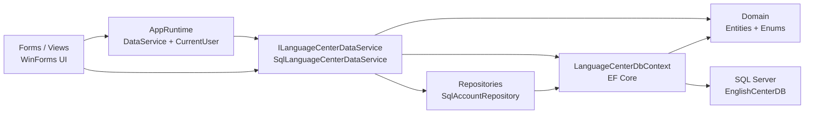

# Phân tích dự án phần mềm quản lý trung tâm ngoại ngữ

Tài liệu này được viết làm đầu vào cho báo cáo đồ án môn Lập trình Ứng dụng Desktop với .NET/C#. Nội dung dựa trên source trong solution `Trung-tam-quan-ly-ngoai-ngu.sln`, gồm 3 project chính: `Trung-tam-quan-ly-ngoai-ngu`, `TrungTamNgoaiNgu.Application`, `TrungTamNgoaiNgu.Domain`, cùng script SQL tại `docs/database-script.sql`.

## 1. Tổng quan dự án

### 1.1. Tên đề tài phù hợp

Tên đề tài đề xuất:

**Xây dựng phần mềm quản lý trung tâm ngoại ngữ bằng C# WinForms, .NET 8 và SQL Server**

Tên ngắn có thể dùng trong bìa báo cáo:

**Phần mềm quản lý trung tâm ngoại ngữ**

Tên theo hướng kỹ thuật:

**Ứng dụng desktop quản lý học viên, lớp học, học phí và giảng dạy cho trung tâm ngoại ngữ**

### 1.2. Mục tiêu của phần mềm

Phần mềm được xây dựng nhằm hỗ trợ trung tâm ngoại ngữ quản lý các nghiệp vụ thường gặp trong quá trình vận hành. Hệ thống tập trung vào 3 nhóm người dùng chính: quản trị viên, nhân viên trung tâm và giáo viên.

Mục tiêu cụ thể:

- Quản lý tài khoản đăng nhập và phân quyền theo vai trò `Admin`, `Staff`, `Teacher`.
- Quản lý hồ sơ học viên, giáo viên, khóa học, lớp học.
- Ghi danh học viên vào lớp, kiểm tra trùng ghi danh và kiểm tra sĩ số lớp.
- Lập phiếu thu học phí, theo dõi số tiền đã thu và công nợ còn lại.
- Hỗ trợ giáo viên xem lớp đang dạy, xem danh sách học viên, điểm danh và nhập điểm.
- Cung cấp dashboard, thống kê, báo cáo, biểu đồ và xuất dữ liệu ra Excel/PDF.
- Tách lớp mã nguồn để dễ bảo trì, dễ mở rộng và phù hợp yêu cầu đồ án desktop.

### 1.3. Lý do chọn đề tài

Trung tâm ngoại ngữ là mô hình phổ biến trong thực tế. Các trung tâm thường phải xử lý nhiều loại dữ liệu như học viên, giáo viên, khóa học, lớp học, lịch học, ghi danh, học phí, công nợ, điểm danh và điểm số. Nếu quản lý bằng sổ sách hoặc file Excel rời rạc, dữ liệu dễ bị sai lệch, khó tìm kiếm, khó thống kê và khó phân quyền trách nhiệm.

Đề tài này phù hợp với môn Lập trình Ứng dụng Desktop vì có nhiều nghiệp vụ rõ ràng, có cơ sở dữ liệu quan hệ, có giao diện nhập liệu, có báo cáo, có xuất file, có xử lý ảnh và có phân quyền người dùng. Dự án cũng phù hợp để vận dụng C# WinForms, Entity Framework Core và SQL Server trong một phần mềm desktop hoàn chỉnh.

### 1.4. Đối tượng sử dụng

- `Admin`: quản trị hệ thống, quản lý tài khoản, theo dõi dashboard tổng quan, xem báo cáo và giám sát hệ thống.
- `Staff`: nhân viên vận hành trung tâm, quản lý học viên, giáo viên, khóa học, lớp học, ghi danh, thu học phí, theo dõi công nợ và xuất báo cáo.
- `Teacher`: giáo viên, xem lớp đang dạy, xem học viên trong lớp, điểm danh, nhập điểm và theo dõi tình hình lớp học.

### 1.5. Bài toán thực tế phần mềm giải quyết

Trong trung tâm ngoại ngữ, mỗi học viên có thể học nhiều lớp khác nhau, mỗi lớp thuộc một khóa học và do một giáo viên phụ trách. Khi học viên đăng ký học, trung tâm cần kiểm tra lớp còn chỗ hay không, học viên đã ghi danh lớp đó chưa, học phí cần thu là bao nhiêu, đã đóng bao nhiêu và còn nợ bao nhiêu. Trong quá trình học, giáo viên cần điểm danh theo buổi và nhập điểm giữa kỳ, cuối kỳ.

Phần mềm giải quyết các vấn đề:

- Tập trung hóa dữ liệu thay vì lưu rời rạc.
- Giảm sai sót khi ghi danh trùng, thu vượt học phí hoặc nhập điểm ngoài khoảng hợp lệ.
- Giúp nhân viên tìm kiếm, lọc, cập nhật dữ liệu nhanh.
- Giúp giáo viên thao tác trên đúng lớp mình phụ trách.
- Giúp quản trị viên xem tình hình hoạt động qua dashboard và báo cáo.
- Hỗ trợ xuất file phục vụ in ấn, lưu trữ và báo cáo.

### 1.6. Phạm vi chức năng của hệ thống

Phạm vi hiện có trong source:

- Đăng nhập và phân quyền theo vai trò.
- Dashboard riêng cho Admin, Staff, Teacher.
- Quản lý tài khoản.
- Ma trận quyền truy cập.
- Quản lý học viên, có avatar.
- Quản lý giáo viên, có avatar.
- Quản lý khóa học.
- Quản lý lớp học, gán khóa học và giáo viên.
- Sinh lịch buổi học dựa trên ngày bắt đầu, ngày kết thúc và chuỗi lịch học của lớp.
- Ghi danh học viên vào lớp.
- Thu học phí, xem lịch sử phiếu thu, in/xuất biên lai.
- Theo dõi công nợ.
- Giáo viên xem lớp, xem danh sách học viên, điểm danh, nhập điểm.
- Báo cáo doanh thu, tuyển sinh, công nợ và biểu đồ.
- Xuất Excel/PDF từ `DataTable`.
- Ghi log lỗi.
- Fallback offline demo khi SQL Server lỗi.

### 1.7. Điểm nổi bật của dự án

- Dùng .NET 8 và WinForms, phù hợp ứng dụng desktop chạy trên Windows.
- Kiến trúc tách lớp rõ: UI, Application, Domain.
- Form không truy cập SQL trực tiếp, mà gọi service qua `AppRuntime.DataService`.
- Có `ILanguageCenterDataService` làm facade trung tâm cho toàn bộ use case.
- Có EF Core `LanguageCenterDbContext` mapping entity sang bảng SQL Server.
- Có repository riêng cho tài khoản: `IAccountRepository`, `SqlAccountRepository`.
- Có hash mật khẩu bằng `PasswordHasher`.
- Có fallback `OfflineLanguageCenterDataService` để demo khi lỗi SQL.
- Có xuất Excel bằng ClosedXML và PDF bằng PdfSharp.
- Có xử lý avatar, lưu ảnh vào thư mục `Images`.
- Có log lỗi ra file `log.txt` và log UI ra `logs/ui-trace.log`.
- Có xử lý DPI/responsive bằng `FormHostHelpers`.

## 2. Môi trường phát triển và công nghệ sử dụng

### 2.1. Hệ điều hành đề xuất

Hệ điều hành phù hợp:

- Windows 10 64-bit.
- Windows 11 64-bit.

Lý do: dự án dùng WinForms với target framework `net8.0-windows`, đây là công nghệ desktop dành cho Windows.

### 2.2. Visual Studio đề xuất

Nên dùng:

- Visual Studio 2022.
- Workload: `Desktop development with .NET`.

Visual Studio 2022 hỗ trợ tốt .NET 8, WinForms Designer, NuGet Package Manager, build/publish ứng dụng Windows.

### 2.3. .NET SDK

Dự án dùng:

- `.NET 8 SDK`.
- UI project target: `net8.0-windows`.
- Application và Domain project target: `net8.0`.

Kiểm tra SDK:

```powershell
dotnet --version
```

### 2.4. WinForms dùng để làm gì

WinForms được dùng làm tầng giao diện desktop. Trong dự án, WinForms đảm nhiệm:

- Form đăng nhập `FrmLogin`.
- Dashboard theo vai trò: `FrmAdminDashboard`, `FrmStaffDashboard`, `FrmTeacherDashboard`.
- Các form nghiệp vụ: quản lý học viên, giáo viên, khóa học, lớp học, ghi danh, học phí, công nợ, điểm danh, nhập điểm, báo cáo.
- Hiển thị danh sách bằng `DataGridView`.
- Nhập liệu bằng `TextBox`, `ComboBox`, `DateTimePicker`, `Button`, `PictureBox`, `ErrorProvider`, `ToolTip`.
- In/preview biên lai bằng `PrintDocument`, `PrintPreviewDialog`.

### 2.5. SQL Server / SQL Server Express dùng để làm gì

SQL Server là hệ quản trị cơ sở dữ liệu chính, dùng để lưu:

- Tài khoản người dùng.
- Học viên.
- Giáo viên.
- Khóa học.
- Lớp học.
- Ghi danh.
- Điểm danh.
- Phiếu thu.
- Điểm số.

SQL Server Express có thể dùng cho máy cá nhân hoặc đồ án sinh viên vì miễn phí, đủ chức năng cho ứng dụng desktop quy mô nhỏ đến trung bình.

### 2.6. SSMS dùng để làm gì

SQL Server Management Studio dùng để:

- Kết nối SQL Server.
- Chạy script `docs/database-script.sql`.
- Kiểm tra database `EnglishCenterDB`.
- Xem bảng, khóa chính, khóa ngoại, dữ liệu mẫu.
- Sửa dữ liệu thử nghiệm khi cần demo.
- Kiểm tra lỗi connection string hoặc quyền truy cập SQL.

### 2.7. Entity Framework Core dùng để làm gì

Entity Framework Core là ORM giúp C# làm việc với SQL Server thông qua entity và LINQ thay vì viết SQL trực tiếp trong form.

Trong dự án:

- `LanguageCenterDbContext` đại diện cho database context.
- `DbSet<AccountEntity>`, `DbSet<StudentEntity>`, `DbSet<TeacherEntity>`... đại diện cho bảng.
- `OnModelCreating()` cấu hình bảng, khóa, quan hệ, kiểu dữ liệu, index, enum conversion.
- `SqlLanguageCenterDataService` dùng EF Core để query, thêm, sửa, xóa mềm, thống kê, báo cáo.

### 2.8. NuGet package đang dùng

| Package | Version | Project | Vai trò |
| --- | --- | --- | --- |
| `Microsoft.EntityFrameworkCore.SqlServer` | `8.0.17` | `TrungTamNgoaiNgu.Application` | Provider EF Core cho SQL Server, cho phép dùng `UseSqlServer`, `DbContext`, LINQ query. |
| `ClosedXML` | `0.104.2` | `Trung-tam-quan-ly-ngoai-ngu` | Xuất dữ liệu `DataTable` ra Excel `.xlsx` trong `ExportFileHelper.ExportDataTableToExcel`. |
| `PdfSharp` | `6.0.0` | `Trung-tam-quan-ly-ngoai-ngu` | Tạo file PDF báo cáo/biên lai trong `ExportFileHelper.ExportDataTableToPdf` và `ExportReceiptToPdf`. |
| `WinForms.DataVisualization` | `1.10.0` | `Trung-tam-quan-ly-ngoai-ngu` | Vẽ biểu đồ trong dashboard/báo cáo bằng Chart control. |

### 2.9. Vì sao công nghệ phù hợp với đồ án desktop

- WinForms dễ học, dễ thiết kế form, phù hợp môn lập trình desktop.
- C# mạnh về OOP, event-driven programming, xử lý dữ liệu và giao diện Windows.
- .NET 8 là nền tảng mới, hỗ trợ tốt hiệu năng và publish ứng dụng.
- SQL Server phù hợp dữ liệu quan hệ, có khóa chính/khóa ngoại rõ ràng.
- EF Core giúp giảm SQL thủ công, thể hiện tư duy ORM và LINQ.
- ClosedXML/PdfSharp giúp đồ án có chức năng xuất file, tăng tính thực tế.

## 3. Cấu trúc solution/project

### 3.1. Tổng quan solution

Solution chính:

```text
Trung-tam-quan-ly-ngoai-ngu.sln
```

Các project chính:

```text
Trung-tam-quan-ly-ngoai-ngu
TrungTamNgoaiNgu.Application
TrungTamNgoaiNgu.Domain
```

### 3.2. Project `Trung-tam-quan-ly-ngoai-ngu`

Đây là tầng giao diện WinForms.

Thành phần chính:

- `Program.cs`: entry point của ứng dụng.
- `Core/AppRuntime.cs`: lưu service hiện tại và user đang đăng nhập.
- `Core/AppTheme.cs`: cấu hình màu sắc, font, style button, style grid.
- `Core/UiHelpers.cs`: helper tạo control, grid, chart, metric card.
- `Core/ExportFileHelper.cs`: xuất Excel/PDF, xuất biên lai PDF.
- `Core/ValidationFeedback.cs`: hiển thị lỗi đầu tiên từ `ErrorProvider`.
- `Forms/Common`: login, base helper form, sidebar preview.
- `Forms/Admin`: dashboard admin, quản lý tài khoản, báo cáo, system monitor, access matrix.
- `Forms/Staff`: dashboard staff, quản lý học viên, giáo viên, khóa học, lớp học, ghi danh, học phí, công nợ.
- `Forms/Teacher`: dashboard teacher, lớp đang dạy, danh sách học viên, điểm danh, nhập điểm.
- `Forms/Dialogs`: dialog xác nhận, trạng thái, xem ảnh.
- `Resources/Images/UI`: ảnh login, logo, icon sidebar.
- `appsettings.json`: cấu hình connection string mặc định.

### 3.3. Project `TrungTamNgoaiNgu.Application`

Đây là tầng nghiệp vụ và truy cập dữ liệu.

Thành phần chính:

- `Contracts/ILanguageCenterDataService.cs`: interface facade trung tâm.
- `Services/SqlLanguageCenterDataService.cs`: service chính dùng SQL Server/EF Core.
- `Services/OfflineLanguageCenterDataService.cs`: service demo in-memory khi SQL lỗi.
- `Services/DemoLanguageCenterDataService.cs`: lớp kế thừa `SqlLanguageCenterDataService`, hiện chưa thêm logic riêng.
- `Repositories/IAccountRepository.cs`: interface repository tài khoản.
- `Repositories/SqlAccountRepository.cs`: repository tài khoản dùng EF Core.
- `Data/LanguageCenterDbContext.cs`: DbContext mapping entity sang bảng SQL.
- `Configuration/LanguageCenterDatabaseConfiguration.cs`: đọc `appsettings.json` và biến môi trường.
- `Configuration/LanguageCenterDatabaseOptions.cs`: model cấu hình database.
- `Security/PasswordHasher.cs`: hash/verify mật khẩu SHA-256.
- `Localization/LanguageCenterValueMapper.cs`: chuẩn hóa trạng thái, giới tính, phương thức thanh toán giữa UI và DB.
- `Infrastructure/ErrorLogger.cs`: ghi log lỗi.
- `Infrastructure/AppPaths.cs`: quản lý đường dẫn runtime, log, thư mục ảnh.
- `Models`: model phụ cho dashboard, báo cáo, điểm danh, nhập điểm, biên lai.

### 3.4. Project `TrungTamNgoaiNgu.Domain`

Đây là tầng domain chứa entity và enum dùng chung.

Thành phần chính:

- `Entities/AccountEntity.cs`
- `Entities/StudentEntity.cs`
- `Entities/TeacherEntity.cs`
- `Entities/CourseEntity.cs`
- `Entities/ClassEntity.cs`
- `Entities/EnrollmentEntity.cs`
- `Entities/ReceiptEntity.cs`
- `Entities/AttendanceEntity.cs`
- `Entities/ScoreEntity.cs`
- `Enums/AccountRole.cs`
- `Enums/AccountStatus.cs`

### 3.5. `docs/database-script.sql`

Script SQL tạo database `EnglishCenterDB`, tạo bảng, khóa chính, khóa ngoại, check constraint, index và seed tài khoản mẫu.

Lưu ý quan trọng:

- Script SQL hiện seed 3 tài khoản mẫu.
- `SqlLanguageCenterDataService` cũng có hàm `SeedData()`, nhưng chỉ chạy khi tất cả bảng chính đều trống.
- Nếu chạy script hiện tại trước, bảng `Accounts` đã có dữ liệu, nên service sẽ không seed thêm học viên/khóa/lớp mẫu.

### 3.6. `Images`, `Resources`, `logs`

- `Resources/Images/UI`: ảnh tĩnh của giao diện, được copy khi build/publish.
- `Images`: thư mục runtime để lưu avatar học viên/giáo viên, ví dụ `Images/Students`, `Images/Teachers`.
- `log.txt`: file log lỗi chính theo `AppPaths.LogFilePath`.
- `logs/ui-trace.log`: file log thao tác UI trong `FormHostHelpers.LogUi`.

### 3.7. `bin` và `obj`

- `bin`: chứa file build output như `.exe`, `.dll`, `.pdb`, resource đã copy.
- `obj`: chứa file trung gian do MSBuild tạo khi restore/build.

Không nên đưa `bin` và `obj` vào báo cáo như source chính vì đây là kết quả build tự sinh, không phải mã nguồn do nhóm viết. Khi viết báo cáo, chỉ nên mô tả ngắn nếu cần giải thích quá trình build/publish.

## 4. Kiến trúc phần mềm

### 4.1. Sơ đồ kiến trúc



Luồng tổng quát:

```text
Forms / Views -> Services -> Repositories -> Data / Database
Domain / Entities dùng chung cho các tầng
```

### 4.2. Vai trò tầng UI/Form

Tầng UI chỉ nên:

- Nhận input từ người dùng.
- Validate cơ bản ở giao diện bằng `ErrorProvider`.
- Hiển thị dữ liệu lên `DataGridView`.
- Bind dữ liệu từ `DataTable`.
- Hiển thị dialog xác nhận/trạng thái.
- Gọi service như `AppRuntime.DataService.GetStudentList()`, `SaveStudent()`, `CreateEnrollment()`.

Tầng UI không nên:

- Mở `SqlConnection` trực tiếp.
- Viết câu SQL trực tiếp.
- Tự tạo `DbContext`.
- Tự xử lý nghiệp vụ phức tạp như kiểm tra trùng ghi danh, thu vượt học phí, parse trạng thái DB.

### 4.3. Vai trò tầng Service

Service xử lý nghiệp vụ:

- Xác thực đăng nhập.
- Validate dữ liệu trước khi lưu.
- Sinh mã tự động như `HV001`, `GV001`, `KH001`, `LP001`, `GD001`, `PT001`.
- Chuẩn hóa trạng thái từ tiếng Việt sang giá trị canonical trong DB.
- Kiểm tra trùng ghi danh.
- Kiểm tra lớp còn chỗ.
- Tính tổng đã thu, còn nợ.
- Tính dashboard và báo cáo.
- Sinh danh sách buổi học từ lịch học của lớp.
- Upsert điểm danh và điểm số.
- Ghi log khi có lỗi.

### 4.4. Vai trò tầng Repository

Repository hiện rõ nhất ở nhóm tài khoản:

- `IAccountRepository`: định nghĩa thao tác tài khoản.
- `SqlAccountRepository`: thao tác EF Core ở mức thấp hơn như tìm active account, lưu tài khoản, khóa/mở khóa, reset mật khẩu.

Trong dự án, nhiều nghiệp vụ khác hiện được đặt trực tiếp trong `SqlLanguageCenterDataService`. Nếu mở rộng, có thể tách thêm repository cho học viên, giáo viên, lớp, ghi danh, phiếu thu.

### 4.5. Vai trò `DbContext`

`LanguageCenterDbContext` đại diện kết nối EF Core tới SQL Server. Nó:

- Khai báo `DbSet` cho các bảng.
- Cấu hình tên bảng.
- Cấu hình khóa chính, khóa ngoại.
- Cấu hình kiểu dữ liệu như `decimal(18,2)`, `datetime2`.
- Cấu hình enum `AccountRole`, `AccountStatus` lưu dạng string.
- Cấu hình index unique/filter.
- Cấu hình quan hệ một-nhiều, một-một.

### 4.6. Vai trò Domain

Domain chứa entity và enum. Đây là mô hình dữ liệu cốt lõi, không phụ thuộc WinForms. Ví dụ:

- `StudentEntity` đại diện học viên.
- `ClassEntity` đại diện lớp học.
- `EnrollmentEntity` đại diện quan hệ ghi danh giữa học viên và lớp.
- `AccountRole` đại diện vai trò tài khoản.

### 4.7. Lợi ích tách lớp

- Dễ bảo trì vì UI và nghiệp vụ không trộn lẫn.
- Dễ debug vì lỗi DB, lỗi nghiệp vụ, lỗi giao diện có vị trí rõ hơn.
- Dễ mở rộng thêm form mới vì form chỉ cần gọi service.
- Dễ thay đổi backend vì UI phụ thuộc interface `ILanguageCenterDataService`.
- Có thể chạy offline demo bằng implementation khác của cùng interface.
- Code sạch hơn, đúng hướng OOP và kiến trúc nhiều tầng.

## 5. Luồng khởi động ứng dụng

### 5.1. `Main()` là điểm bắt đầu

File: `Trung-tam-quan-ly-ngoai-ngu/Program.cs`

`Main()` được đánh dấu `[STAThread]`, phù hợp ứng dụng WinForms.

Luồng chính:

1. `Application.SetHighDpiMode(HighDpiMode.SystemAware)`.
2. `Application.EnableVisualStyles()`.
3. `Application.SetCompatibleTextRenderingDefault(false)`.
4. Gọi `TryInitializeRuntime()`.
5. Nếu khởi tạo thất bại nghiêm trọng thì return.
6. Đăng ký xử lý lỗi toàn cục.
7. Mở form login bằng `Application.Run(new FrmLogin(AppRuntime.DataService))`.

### 5.2. High DPI và visual style

- `SetHighDpiMode(HighDpiMode.SystemAware)` giúp giao diện scale theo DPI hệ thống.
- `EnableVisualStyles()` bật style Windows hiện đại hơn cho control.
- `SetCompatibleTextRenderingDefault(false)` dùng GDI+ text rendering mặc định mới hơn.

Trong project file UI cũng có cấu hình `<ApplicationHighDpiMode>PerMonitorV2</ApplicationHighDpiMode>`, nhưng code runtime hiện gọi `SystemAware`. Khi viết báo cáo, nên mô tả theo code đang chạy trong `Program.cs`.

### 5.3. Tạo `SqlLanguageCenterDataService`

Trong `TryInitializeRuntime()`:

```csharp
AppRuntime.Initialize(new SqlLanguageCenterDataService());
```

Constructor của `SqlLanguageCenterDataService` đọc cấu hình database từ:

- `appsettings.json`.
- Biến môi trường `TTNN_SQL_CONNECTION_STRING`.
- Biến môi trường `TTNN_SQL_PASSWORD`.

Sau đó tạo `DbContextOptions<LanguageCenterDbContext>` bằng `UseSqlServer`.

### 5.4. `AppRuntime.Initialize`

`AppRuntime.Initialize()`:

- Gán service vào `_dataService`.
- Gọi `_dataService.EnsureDatabaseReady()`.

`AppRuntime.DataService` là service trung tâm cho toàn bộ form. Nếu form cần dữ liệu, form gọi `AppRuntime.DataService`.

### 5.5. `EnsureDatabaseReady`

`SqlLanguageCenterDataService.EnsureDatabaseReady()`:

1. Gọi `_accountRepository.CanConnect()` để kiểm tra SQL Server.
2. Nếu không kết nối được thì throw exception.
3. Tạo `LanguageCenterDbContext`.
4. Nếu tất cả bảng chính đều trống thì gọi `SeedData(context)`.
5. Nếu lỗi thì ghi log bằng `ErrorLogger.Log(exception, "EnsureDatabaseReady")`.

### 5.6. Fallback sang offline demo

Nếu SQL Server lỗi ở bước khởi tạo:

1. `Program.cs` catch exception.
2. Ghi log với context `InitializeDatabase`.
3. Gọi `AppRuntime.Initialize(new OfflineLanguageCenterDataService())`.
4. Hiển thị `MessageBox` thông báo app chuyển sang offline demo.
5. Người dùng vẫn có thể đăng nhập demo bằng:
   - `admin / 123456`
   - `staff / 123456`
   - `teacher / 123456`

Ý nghĩa: khi máy demo không kết nối SQL được, app vẫn mở được để kiểm tra giao diện và luồng cơ bản.

### 5.7. Xử lý lỗi toàn cục

`Program.cs` đăng ký:

- `Application.ThreadException`
- `AppDomain.CurrentDomain.UnhandledException`

Khi lỗi chưa được bắt xảy ra, app gọi `HandleUnhandledException()`:

- Ghi log bằng `ErrorLogger`.
- Hiển thị thông báo lỗi hệ thống.
- Nếu logger cũng lỗi, hiển thị `exception.ToString()`.

### 5.8. `AppRuntime.DataService` và `AppRuntime.CurrentUser`

`AppRuntime.DataService`:

- Là cổng truy cập dữ liệu/nghiệp vụ dùng chung.
- Có thể là SQL service hoặc offline service.
- Giúp form không cần biết service cụ thể.

`AppRuntime.CurrentUser`:

- Lưu tài khoản đang đăng nhập.
- Được set sau khi login thành công.
- Được dùng trong teacher flow để lọc lớp theo giáo viên.
- Được dùng khi lập phiếu thu để lưu `CreatedByStaffId`.
- Được reset về `null` khi logout/đóng dashboard.

## 6. Luồng đăng nhập và phân quyền

### 6.1. Người dùng nhập username/password

Form: `Forms/Common/FrmLogin.cs`

Người dùng nhập:

- Tên đăng nhập.
- Mật khẩu.

Form kiểm tra rỗng bằng `ErrorProvider`. Nếu thiếu username hoặc password, form hiển thị lỗi ngay trên giao diện.

### 6.2. `FrmLogin` gọi `Authenticate`

Khi bấm Đăng nhập:

```csharp
var account = _dataService.Authenticate(txtUsername.Text.Trim(), txtPassword.Text.Trim());
```

Nếu `account == null`, form báo sai tài khoản hoặc mật khẩu.

Nếu thành công:

```csharp
AppRuntime.SetCurrentUser(account);
```

### 6.3. Hash/verify mật khẩu

Class: `PasswordHasher`

`Hash(plainTextPassword)`:

- Dùng SHA-256.
- Mã hóa password thành byte UTF-8.
- Chuyển hash sang chuỗi hex bằng `Convert.ToHexString`.

`Verify(plainTextPassword, passwordHash)`:

- Hash lại password người dùng nhập.
- So sánh với `PasswordHash` trong DB.
- So sánh không phân biệt hoa thường.

Ví dụ hash của `123456`:

```text
8D969EEF6ECAD3C29A3A629280E686CF0C3F5D5A86AFF3CA12020C923ADC6C92
```

Ghi chú bảo mật: SHA-256 một chiều tốt hơn lưu plain text, nhưng chưa có salt. Với đồ án desktop, cách này đủ để minh họa nguyên tắc không lưu mật khẩu gốc. Nếu phát triển thực tế, nên dùng thuật toán có salt và work factor như PBKDF2, BCrypt hoặc Argon2.

### 6.4. Mở dashboard theo role

Sau khi login thành công:

- `AccountRole.Admin` -> `FrmAdminDashboard`.
- `AccountRole.Staff` -> `FrmStaffDashboard`.
- `AccountRole.Teacher` -> `FrmTeacherDashboard`.

Role được lưu trong `AccountEntity.Role` và enum `AccountRole`.

### 6.5. Vai trò `AccountRole`

`AccountRole` có 3 giá trị:

- `Admin`: quản trị hệ thống.
- `Staff`: nhân viên vận hành.
- `Teacher`: giáo viên.

Vai trò này quyết định dashboard và chức năng người dùng nhìn thấy sau đăng nhập.

### 6.6. Vai trò `AccountStatus`

`AccountStatus` có 3 giá trị:

- `Active`: tài khoản hoạt động, được phép đăng nhập.
- `Inactive`: tài khoản tạm ngưng.
- `Locked`: tài khoản bị khóa.

`SqlAccountRepository.FindActiveByUsername()` chỉ tìm tài khoản:

- Không bị xóa mềm.
- Có `Status == AccountStatus.Active`.
- Username khớp.

Tài khoản `Inactive` hoặc `Locked` không đăng nhập được.

### 6.7. Tài khoản mẫu

Trong script SQL:

- `Admin / 123456`
- `Staff / 123456`
- `Teacher / 123456`

Repository SQL tìm username theo dạng lower-case, nên người dùng có thể nhập `admin`, `staff`, `teacher` hoặc đúng chữ hoa/thường đều được.

## 7. Cơ sở dữ liệu SQL Server

### 7.1. Tên database

Database:

```text
EnglishCenterDB
```

Script:

```text
docs/database-script.sql
```

### 7.2. Cách chạy script bằng SSMS

1. Mở SQL Server Management Studio.
2. Kết nối SQL Server local hoặc SQL Server Express.
3. Mở file `docs/database-script.sql`.
4. Bấm Execute để chạy toàn bộ script.
5. Kiểm tra database `EnglishCenterDB`.
6. Kiểm tra các bảng chính đã được tạo.
7. Kiểm tra bảng `Accounts` có 3 tài khoản mẫu.

### 7.3. Các bảng chính

| Bảng | Ý nghĩa nghiệp vụ |
| --- | --- |
| `Accounts` | Lưu tài khoản đăng nhập, mật khẩu hash, vai trò, trạng thái. |
| `Students` | Lưu hồ sơ học viên. |
| `Teachers` | Lưu hồ sơ giáo viên, chuyên môn, tài khoản liên kết. |
| `Courses` | Lưu khóa học, mô tả, học phí. |
| `Classes` | Lưu lớp học cụ thể thuộc khóa học, có giáo viên, lịch học, phòng, sĩ số. |
| `Enrollments` | Lưu học viên ghi danh vào lớp. Đây là bảng trung gian giữa học viên và lớp. |
| `Attendances` | Lưu điểm danh theo từng ghi danh và ngày học. |
| `Receipts` | Lưu phiếu thu học phí. |
| `Scores` | Lưu điểm giữa kỳ, cuối kỳ của học viên trong lớp. |

### 7.4. Quan hệ giữa các bảng

- `Teachers.AccountId` -> `Accounts.Id`: giáo viên có thể liên kết với một tài khoản đăng nhập.
- `Classes.CourseId` -> `Courses.Id`: mỗi lớp thuộc một khóa học.
- `Classes.TeacherId` -> `Teachers.Id`: mỗi lớp có một giáo viên phụ trách.
- `Enrollments.StudentId` -> `Students.Id`: mỗi ghi danh thuộc một học viên.
- `Enrollments.ClassId` -> `Classes.Id`: mỗi ghi danh thuộc một lớp.
- `Receipts.EnrollmentId` -> `Enrollments.Id`: mỗi phiếu thu gắn với một ghi danh.
- `Receipts.CreatedByStaffId` -> `Accounts.Id`: phiếu thu có thể lưu nhân viên tạo.
- `Attendances.EnrollmentId` -> `Enrollments.Id`: điểm danh gắn với ghi danh.
- `Scores.EnrollmentId` -> `Enrollments.Id`: điểm số gắn với ghi danh.

### 7.5. Khóa chính và khóa ngoại

Khóa chính:

- `PK_Accounts`: `Accounts.Id`
- `PK_Students`: `Students.Id`
- `PK_Teachers`: `Teachers.Id`
- `PK_Courses`: `Courses.Id`
- `PK_Classes`: `Classes.Id`
- `PK_Enrollments`: `Enrollments.Id`
- `PK_Attendances`: `Attendances.Id`
- `PK_Receipts`: `Receipts.Id`
- `PK_Scores`: `Scores.Id`

Khóa ngoại chính:

- `FK_Teachers_Accounts_AccountId`
- `FK_Classes_Courses_CourseId`
- `FK_Classes_Teachers_TeacherId`
- `FK_Enrollments_Students_StudentId`
- `FK_Enrollments_Classes_ClassId`
- `FK_Receipts_Enrollments_EnrollmentId`
- `FK_Receipts_Accounts_CreatedByStaffId`
- `FK_Attendances_Enrollments_EnrollmentId`
- `FK_Scores_Enrollments_EnrollmentId`

### 7.6. Index và ràng buộc đáng chú ý

- `Accounts.Username` unique khi `IsDeleted = 0`.
- `Accounts.Email` unique khi `IsDeleted = 0`.
- `Accounts.Phone` unique khi `IsDeleted = 0`.
- `Students.Email` unique nếu email không null và chưa xóa mềm.
- `Students.Phone` unique khi chưa xóa mềm.
- `Teachers.Email`, `Teachers.Phone` unique khi chưa xóa mềm.
- `Teachers.AccountId` unique nếu không null và chưa xóa mềm.
- `Enrollments.StudentId + ClassId` unique khi chưa xóa mềm để hạn chế ghi danh trùng.
- `Attendances.EnrollmentId + AttendanceDate` unique để một học viên trong lớp chỉ có một record điểm danh cho một ngày.
- `Scores.EnrollmentId` unique để mỗi ghi danh chỉ có một bảng điểm.

Check constraint:

- Role account chỉ nhận `Admin`, `Staff`, `Teacher`.
- Status account chỉ nhận `Active`, `Inactive`, `Locked`.
- Học phí >= 0.
- Sĩ số lớp > 0.
- Ngày kết thúc lớp >= ngày bắt đầu.
- Điểm nằm trong khoảng 0 đến 10.
- Số tiền phiếu thu > 0.

### 7.7. Dữ liệu mẫu/seed data

Có 3 nguồn seed cần phân biệt:

1. `docs/database-script.sql` seed 3 tài khoản:
   - `ACC001`, username `Admin`, role `Admin`.
   - `ACC002`, username `Staff`, role `Staff`.
   - `ACC003`, username `Teacher`, role `Teacher`.

2. `SqlLanguageCenterDataService.SeedData()` có dữ liệu mẫu đầy đủ nếu toàn bộ bảng trống:
   - 3 account.
   - 3 giáo viên.
   - 3 khóa học.
   - 3 lớp học.
   - 6 học viên.
   - 6 ghi danh.
   - 6 phiếu thu.
   - 3 điểm danh.
   - 3 bảng điểm.

3. `OfflineLanguageCenterDataService` seed dữ liệu in-memory để demo khi lỗi SQL.

Vì sao cần seed data:

- Giúp đăng nhập ngay sau khi setup.
- Giúp demo giao diện không bị trống.
- Giúp kiểm thử báo cáo, công nợ, điểm danh, nhập điểm nhanh hơn.
- Giúp giảng viên nhìn thấy luồng nghiệp vụ hoàn chỉnh.

### 7.8. Vì sao `PasswordHash` không nên lưu plain text

Nếu lưu mật khẩu dạng plain text, người có quyền xem database sẽ biết mật khẩu thật của người dùng. Khi dùng hash một chiều, database chỉ lưu chuỗi băm. Khi đăng nhập, hệ thống hash password nhập vào rồi so sánh. Cách này giảm rủi ro lộ mật khẩu gốc.

### 7.9. Connection string trong `appsettings.json` và biến môi trường

File:

```text
Trung-tam-quan-ly-ngoai-ngu/appsettings.json
```

Biến môi trường hỗ trợ:

- `TTNN_SQL_CONNECTION_STRING`
- `TTNN_SQL_PASSWORD`

Lý do hỗ trợ biến môi trường:

- Tránh commit mật khẩu SQL thật vào source code.
- Dễ đổi server khi chuyển máy demo.
- Cho phép publish app rồi cấu hình lại bên ngoài code.

## 8. Entity và mô hình dữ liệu

### 8.1. `AccountEntity`

Đại diện tài khoản đăng nhập.

Property quan trọng:

- `Id`: mã tài khoản.
- `Username`: tên đăng nhập.
- `PasswordHash`: mật khẩu đã hash.
- `DisplayName`: tên hiển thị.
- `Email`, `Phone`: thông tin liên hệ.
- `Role`: vai trò `Admin`, `Staff`, `Teacher`.
- `Status`: trạng thái `Active`, `Inactive`, `Locked`.
- `IsDeleted`: xóa mềm.
- `CreatedAt`, `UpdatedAt`: audit.

Mapping SQL:

- Bảng `Accounts`.

Quan hệ:

- Một account có thể có một `TeacherProfile`.
- Một account staff có thể tạo nhiều `ReceiptEntity` qua `CreatedReceipts`.

Chức năng tham gia:

- Đăng nhập.
- Phân quyền.
- Quản lý tài khoản.
- Ghi nhận nhân viên tạo phiếu thu.

### 8.2. `StudentEntity`

Đại diện học viên.

Property quan trọng:

- `Id`: mã học viên.
- `FullName`: họ tên.
- `BirthDate`: ngày sinh.
- `Phone`, `Email`, `Address`: liên hệ.
- `AvatarPath`: đường dẫn avatar.
- `Status`: trạng thái học viên.
- `IsDeleted`: xóa mềm.

Mapping SQL:

- Bảng `Students`.

Quan hệ:

- Một học viên có nhiều `EnrollmentEntity`.

Chức năng tham gia:

- Quản lý học viên.
- Ghi danh.
- Thu học phí.
- Công nợ.
- Điểm danh.
- Nhập điểm.

### 8.3. `TeacherEntity`

Đại diện giáo viên.

Property quan trọng:

- `Id`: mã giáo viên.
- `FullName`: họ tên.
- `Phone`, `Email`: liên hệ.
- `Specialization`: chuyên môn.
- `Gender`: giới tính.
- `Address`: địa chỉ.
- `AvatarPath`: avatar.
- `AccountId`: tài khoản đăng nhập liên kết.
- `Status`: trạng thái.

Mapping SQL:

- Bảng `Teachers`.

Quan hệ:

- Có thể liên kết một `AccountEntity`.
- Một giáo viên có nhiều `ClassEntity`.

Chức năng tham gia:

- Quản lý giáo viên.
- Gán giáo viên cho lớp.
- Teacher dashboard lọc lớp theo tài khoản giáo viên.

### 8.4. `CourseEntity`

Đại diện khóa học.

Property quan trọng:

- `Id`: mã khóa học.
- `Name`: tên khóa.
- `Description`: mô tả.
- `TuitionFee`: học phí.
- `Status`: trạng thái.
- `IsDeleted`: xóa mềm.

Mapping SQL:

- Bảng `Courses`.

Quan hệ:

- Một khóa học có nhiều lớp.

Chức năng tham gia:

- Quản lý khóa học.
- Tính học phí khi ghi danh/thu tiền.
- Báo cáo theo khóa.

### 8.5. `ClassEntity`

Đại diện lớp học cụ thể.

Property quan trọng:

- `Id`: mã lớp.
- `Name`: tên lớp.
- `CourseId`: khóa học.
- `TeacherId`: giáo viên.
- `StartDate`, `EndDate`: thời gian học.
- `Schedule`: lịch học.
- `Room`: phòng học.
- `MaxStudents`: sĩ số tối đa.
- `Status`: trạng thái.

Mapping SQL:

- Bảng `Classes`.

Quan hệ:

- Thuộc một `CourseEntity`.
- Thuộc một `TeacherEntity`.
- Có nhiều `EnrollmentEntity`.

Chức năng tham gia:

- Quản lý lớp.
- Ghi danh.
- Điểm danh.
- Nhập điểm.
- Teacher dashboard.

### 8.6. `EnrollmentEntity`

Đại diện việc học viên ghi danh vào lớp.

Property quan trọng:

- `Id`: mã ghi danh.
- `StudentId`: học viên.
- `ClassId`: lớp.
- `EnrollDate`: ngày ghi danh.
- `Status`: trạng thái ghi danh.
- `Note`: ghi chú.
- `IsDeleted`: xóa mềm.

Mapping SQL:

- Bảng `Enrollments`.

Quan hệ:

- Thuộc một `StudentEntity`.
- Thuộc một `ClassEntity`.
- Có nhiều `ReceiptEntity`.
- Có nhiều `AttendanceEntity`.
- Có một `ScoreEntity`.

Chức năng tham gia:

- Ghi danh.
- Thu học phí.
- Công nợ.
- Điểm danh.
- Nhập điểm.

### 8.7. `ReceiptEntity`

Đại diện phiếu thu học phí.

Property quan trọng:

- `Id`: mã phiếu thu.
- `EnrollmentId`: ghi danh được thu tiền.
- `AmountPaid`: số tiền thu.
- `PayDate`: ngày thu.
- `PaymentMethod`: phương thức thanh toán.
- `Note`: ghi chú.
- `CreatedByStaffId`: nhân viên tạo phiếu.
- `IsDeleted`: xóa mềm.

Mapping SQL:

- Bảng `Receipts`.

Quan hệ:

- Thuộc một `EnrollmentEntity`.
- Có thể liên kết `AccountEntity` của nhân viên tạo.

Chức năng tham gia:

- Thu học phí.
- Lịch sử phiếu thu.
- Biên lai.
- Báo cáo doanh thu.
- Công nợ.

### 8.8. `AttendanceEntity`

Đại diện điểm danh một học viên trong một ngày học.

Property quan trọng:

- `Id`: mã điểm danh.
- `EnrollmentId`: ghi danh.
- `AttendanceDate`: ngày học.
- `Status`: trạng thái `Present`, `Absent`, `Late`, `Excused`.
- `Note`: ghi chú.

Mapping SQL:

- Bảng `Attendances`.

Quan hệ:

- Thuộc một `EnrollmentEntity`.

Chức năng tham gia:

- Giáo viên điểm danh.
- Theo dõi chuyên cần.

### 8.9. `ScoreEntity`

Đại diện điểm số học viên trong một lớp.

Property quan trọng:

- `Id`: mã điểm.
- `EnrollmentId`: ghi danh.
- `MidtermScore`: điểm giữa kỳ.
- `FinalScore`: điểm cuối kỳ.
- `Note`: ghi chú.

Mapping SQL:

- Bảng `Scores`.

Quan hệ:

- Một-một với `EnrollmentEntity`.

Chức năng tham gia:

- Giáo viên nhập điểm.
- Theo dõi kết quả học tập.

## 9. Enum và model phụ

### 9.1. `AccountRole`

```csharp
public enum AccountRole
{
    Admin,
    Staff,
    Teacher
}
```

Dùng để phân quyền và mở dashboard tương ứng.

### 9.2. `AccountStatus`

```csharp
public enum AccountStatus
{
    Active,
    Inactive,
    Locked
}
```

Dùng để kiểm soát tài khoản có được đăng nhập hay không.

### 9.3. Vì sao dùng enum tốt hơn string tự do

- Tránh nhập sai như `admin`, `ADMINN`, `teacher_role`.
- Giúp code rõ nghĩa và được kiểm tra khi compile.
- Dễ switch theo role/status.
- EF Core có thể lưu enum dạng string trong DB nhưng C# vẫn dùng kiểu mạnh.
- Giảm lỗi phân quyền do giá trị không thống nhất.

### 9.4. Các model phụ trong Application

| Model | Vai trò |
| --- | --- |
| `DashboardStats` | Chứa KPI dashboard: tổng nhân viên, giáo viên, lớp, học viên, phiếu thu, doanh thu, công nợ, học viên mới. |
| `TeacherDashboardStats` | Chứa KPI riêng cho giáo viên: số lớp đang dạy, số học viên, số buổi/lớp hôm nay theo logic hiện tại, số điểm cần nhập. |
| `AttendanceSaveItem` | Item form gửi lên khi lưu điểm danh: `EnrollmentId`, `Status`, `Note`. |
| `ScoreSaveItem` | Item form gửi lên khi lưu điểm: `EnrollmentId`, `MidtermScore`, `FinalScore`, `Note`. |
| `EnrollmentReceiptContext` | Dữ liệu tổng hợp phục vụ thu học phí: học viên, lớp, khóa, học phí, đã thu, còn nợ. |
| `ReceiptPrintInfo` | Dữ liệu tổng hợp để in/xuất biên lai. |
| `ReportPoint` | Điểm dữ liệu biểu đồ: `Label`, `Value`. |

## 10. Tầng Application

### 10.1. `ILanguageCenterDataService` là facade trung tâm

Interface này gom hầu hết use case của hệ thống:

- Khởi tạo database.
- Đăng nhập.
- Sinh mã.
- Quản lý tài khoản.
- Lấy danh sách cho grid.
- Dashboard stats.
- Báo cáo.
- CRUD học viên, giáo viên, khóa, lớp.
- Ghi danh.
- Thu học phí.
- Điểm danh.
- Nhập điểm.
- Avatar.
- Export database script.

Ý nghĩa: form không cần biết repository, DbContext hay SQL. Form chỉ gọi `AppRuntime.DataService`.

### 10.2. Vì sao form chỉ cần gọi `AppRuntime.DataService`

`AppRuntime.DataService` giúp:

- Giảm truyền dependency phức tạp giữa nhiều WinForms.
- Cho phép đổi service SQL sang offline demo khi SQL lỗi.
- Tạo một cổng nghiệp vụ thống nhất.
- Giúp code form ngắn hơn.

Đánh đổi: đây là dạng singleton runtime, chưa dùng dependency injection container. Với đồ án desktop, cách này dễ hiểu và phù hợp.

### 10.3. `SqlLanguageCenterDataService`

Đây là service chính dùng SQL Server.

Nhiệm vụ:

- Đọc cấu hình DB.
- Tạo EF Core options.
- Kiểm tra kết nối SQL.
- Seed dữ liệu nếu database trống.
- Xác thực đăng nhập.
- Query dữ liệu và trả `DataTable`.
- Lưu entity.
- Xóa mềm.
- Xử lý nghiệp vụ ghi danh, học phí, công nợ, điểm danh, điểm số.
- Tính dashboard và báo cáo.
- Lưu avatar qua `AppPaths.SaveImage`.
- Xuất create script qua `context.Database.GenerateCreateScript()`.

### 10.4. `OfflineLanguageCenterDataService`

Đây là implementation in-memory của `ILanguageCenterDataService`.

Nhiệm vụ:

- Seed tài khoản và dữ liệu demo trong list.
- Cho phép đăng nhập demo.
- Cho phép form tải danh sách và thao tác cơ bản.
- Không cần SQL Server.

Giới hạn:

- Dữ liệu không bền vững sau khi tắt app.
- Không thay thế database thật.
- Không có đầy đủ ràng buộc SQL như production.

### 10.5. `DemoLanguageCenterDataService`

Hiện tại class này chỉ kế thừa `SqlLanguageCenterDataService` và chưa bổ sung logic riêng. Có thể xem là điểm mở rộng cho chế độ demo SQL hoặc cấu hình demo sau này.

### 10.6. `IAccountRepository` và `SqlAccountRepository`

`IAccountRepository` định nghĩa:

- `CanConnect()`
- `FindActiveByUsername()`
- `GetNextId()`
- `GetAccounts()`
- `Save()`
- `ToggleStatus()`
- `ResetPassword()`

`SqlAccountRepository` triển khai bằng EF Core. Nó xử lý truy vấn/lưu tài khoản ở mức data access. Service gọi repository và bổ sung rule nghiệp vụ như hash password mặc định.

### 10.7. `PasswordHasher`

Nhiệm vụ:

- Hash password bằng SHA-256.
- Verify password khi đăng nhập.
- Không lưu password plain text.

### 10.8. `LanguageCenterDatabaseConfiguration`

Nhiệm vụ:

- Đọc file `appsettings.json` trong `AppContext.BaseDirectory`.
- Đọc biến môi trường `TTNN_SQL_CONNECTION_STRING`.
- Đọc biến môi trường `TTNN_SQL_PASSWORD`.
- Chuẩn hóa connection string.
- Tự thêm `Connect Timeout=5` nếu chưa có.
- Bỏ `Command Timeout` khỏi connection string và dùng `CommandTimeoutSeconds` riêng.

### 10.9. `LanguageCenterValueMapper`

Nhiệm vụ:

- Chuẩn hóa status khóa học, học viên, giáo viên, lớp, ghi danh.
- Chuẩn hóa giới tính giáo viên.
- Chuẩn hóa phương thức thanh toán.
- Chuyển giá trị DB canonical sang text hiển thị tiếng Việt.
- Chuẩn hóa `AccountStatus`.

Ví dụ:

- UI: `Đang học` hoặc `Dang hoc` -> DB: `Active`.
- DB: `BankTransfer` -> UI: `Chuyển khoản`.
- UI: `Tiền mặt` -> DB: `Cash`.

### 10.10. `ErrorLogger`

Nhiệm vụ:

- Ghi lỗi vào file log.
- Ghi thời gian, context, message, stack trace.
- Dùng lock để tránh nhiều thread ghi cùng lúc.
- Nuốt lỗi logger để không làm app crash thêm.

File log chính:

```text
log.txt
```

### 10.11. `AppPaths`

Nhiệm vụ:

- Cung cấp `BaseDirectory`.
- Cung cấp `LogFilePath`.
- Cung cấp `ImagesDirectory`.
- Tạo thư mục ảnh con.
- Lưu ảnh avatar vào `Images/Students` hoặc `Images/Teachers`.
- Resolve đường dẫn tương đối sang đường dẫn tuyệt đối.
- Tìm workspace root nếu cần.

## 11. Các nhóm chức năng chính

### 11.1. Admin

| Chức năng | Form | Input | Output | Service/method liên quan | Ý nghĩa |
| --- | --- | --- | --- | --- | --- |
| Dashboard tổng quan | `FrmAdminDashboard` | Không bắt buộc, user hiện tại | KPI, warning, snapshot | `GetAdminDashboardStats`, `GetAccounts`, `GetAdminWarnings`, `GetMonitorActivity` | Admin nắm tổng quan hệ thống. |
| Quản lý tài khoản | `FrmAccountManagement` | Username, display name, email, phone, role, status, password | Danh sách account, account đã lưu | `GetAccounts`, `GetNextAccountId`, `SaveAccount`, `ToggleAccountStatus`, `ResetAccountPassword` | Tạo/sửa/khóa/reset tài khoản. |
| Ma trận quyền | `FrmAccessMatrix` | Không bắt buộc | Bảng quyền theo role | `GetAccessMatrix`, export Excel có thể liên quan | Minh họa phân quyền hệ thống. |
| Báo cáo thống kê | `FrmAdminReports` | Loại báo cáo, khoảng ngày | KPI, chart, detail grid, Excel/PDF/CSV | `GetAdminDashboardStats`, `GetReportDetail`, `GetMonthlyRevenue`, `GetMonthlyEnrollmentCounts`, `GetDebtList` | Phân tích doanh thu, tuyển sinh, công nợ. |
| System monitor | `FrmSystemMonitor` | Bộ lọc/refresh | Log hoạt động, KPI hệ thống | `GetMonitorDetailedLog`, `GetStudentList`, `GetTeacherList`, `GetClassList`, `GetAccounts` | Theo dõi trạng thái vận hành. |

### 11.2. Staff

| Chức năng | Form | Input | Output | Service/method liên quan | Ý nghĩa |
| --- | --- | --- | --- | --- | --- |
| Dashboard nhân viên | `FrmStaffDashboard` | Không bắt buộc | KPI, phiếu thu gần đây | `GetStaffDashboardStats`, `GetDebtList`, `GetRecentReceipts` | Staff xem việc cần xử lý. |
| Quản lý học viên | `FrmStudentManagement` | Mã, họ tên, ngày sinh, SĐT, email, địa chỉ, avatar, trạng thái | Hồ sơ học viên | `GetStudentList`, `GetNextStudentId`, `GetStudentById`, `SaveStudent`, `SoftDeleteStudent`, `SaveStudentAvatar` | Quản lý thông tin học viên. |
| Quản lý giáo viên | `FrmTeacherManagement` | Mã, họ tên, SĐT, email, chuyên môn, giới tính, địa chỉ, avatar, account | Hồ sơ giáo viên | `GetTeacherList`, `GetNextTeacherId`, `GetTeacherById`, `SaveTeacher`, `SoftDeleteTeacher`, `SaveTeacherAvatar` | Quản lý đội ngũ giảng dạy. |
| Quản lý khóa học | `FrmCourseManagement` | Mã, tên khóa, mô tả, học phí, trạng thái | Khóa học | `GetCourseList`, `GetNextCourseId`, `GetCourseById`, `SaveCourse`, `SoftDeleteCourse` | Quản lý sản phẩm đào tạo. |
| Quản lý lớp học | `FrmClassManagement` | Mã lớp, tên lớp, khóa học, giáo viên, ngày học, lịch, phòng, sĩ số | Lớp học, học viên trong lớp, buổi học | `GetClassList`, `GetNextClassId`, `GetClassById`, `SaveClass`, `SoftDeleteClass`, `GetClassStudents`, `GetSessions` | Quản lý lớp cụ thể. |
| Ghi danh | `FrmEnrollment` | Học viên, lớp, ngày, status, ghi chú/giảm trừ | Enrollment mới | `GetEnrollmentStudents`, `GetEnrollmentClasses`, `StudentAlreadyEnrolled`, `ClassHasAvailableSlot`, `CreateEnrollment` | Đưa học viên vào lớp. |
| Thu học phí | `FrmTuitionReceipt` | Enrollment/học viên, số tiền, ngày thu, phương thức, ghi chú | Receipt, lịch sử thu, print info | `GetEnrollmentReceiptContext`, `SaveReceipt`, `GetReceiptPrintInfo`, `GetReceiptHistory` | Thu tiền và in/xuất biên lai. |
| Theo dõi công nợ | `FrmDebtTracking` | Khóa, lớp, khoảng ngày | Danh sách nợ, tổng nợ, Excel/PDF | `GetDebtList` | Theo dõi khoản phải thu còn lại. |

### 11.3. Teacher

| Chức năng | Form | Input | Output | Service/method liên quan | Ý nghĩa |
| --- | --- | --- | --- | --- | --- |
| Dashboard giáo viên | `FrmTeacherDashboard` | Current user | KPI, lớp đang dạy | `GetTeacherDashboardStats`, `GetTeachingClasses` | Giáo viên xem tình hình giảng dạy. |
| Xem lớp đang dạy | `FrmTeachingClasses` | Keyword/status | Danh sách lớp | `GetTeachingClasses` | Giáo viên chọn lớp cần thao tác. |
| Xem học viên trong lớp | `FrmClassStudentList` | Lớp, keyword/status | Danh sách học viên | `GetTeachingClasses`, `GetClassStudents` | Theo dõi học viên từng lớp. |
| Điểm danh | `FrmAttendance` | Lớp, ngày/buổi, trạng thái từng học viên | Attendance đã lưu | `GetTeachingClasses`, `GetSessions`, `GetAttendanceList`, `SaveAttendance` | Ghi nhận chuyên cần. |
| Nhập điểm | `FrmScoreEntry` | Lớp, điểm giữa kỳ, điểm cuối kỳ, ghi chú | Score đã lưu | `GetTeachingClasses`, `GetScoreList`, `SaveScores` | Quản lý kết quả học tập. |

## 12. Luồng nghiệp vụ chính

### Luồng 1: Đăng nhập

Người dùng mở app. `Program.cs` khởi tạo runtime và mở `FrmLogin`. Người dùng nhập username/password. `FrmLogin` kiểm tra rỗng, sau đó gọi `Authenticate`. Service tìm tài khoản active trong bảng `Accounts`, verify mật khẩu bằng `PasswordHasher`. Nếu sai, form hiện lỗi. Nếu đúng, app lưu tài khoản vào `AppRuntime.CurrentUser` và mở dashboard theo `AccountRole`.

### Luồng 2: Quản lý học viên

Staff mở `FrmStudentManagement`. Form gọi `GetStudentList` để hiển thị danh sách. Staff tìm kiếm/lọc theo keyword hoặc status. Khi thêm mới, form lấy mã bằng `GetNextStudentId`. Khi lưu, form tạo `StudentEntity` và gọi `SaveStudent`. Service validate họ tên và số điện thoại, normalize status, lưu DB. Khi xóa, form gọi `SoftDeleteStudent`, dữ liệu được đánh dấu `IsDeleted = true`.

### Luồng 3: Quản lý giáo viên

Staff mở `FrmTeacherManagement`. Form tải danh sách bằng `GetTeacherList`. Khi nhập thông tin, staff có thể chọn giới tính, chuyên môn, địa chỉ, avatar và account liên kết nếu có. Khi lưu, form gọi `SaveTeacher`. Service validate họ tên, số điện thoại, email; normalize giới tính/trạng thái; lưu vào bảng `Teachers`.

### Luồng 4: Quản lý khóa học và lớp học

Staff tạo khóa học trong `FrmCourseManagement` với tên, mô tả, học phí, trạng thái. Service lưu vào `Courses`. Sau đó staff tạo lớp trong `FrmClassManagement`, chọn khóa học, giáo viên, ngày bắt đầu/kết thúc, lịch học, phòng học, sĩ số. Service kiểm tra ngày hợp lệ, sĩ số > 0, resolve course/teacher ID và lưu vào `Classes`.

### Luồng 5: Ghi danh

Staff mở `FrmEnrollment`. Form tải học viên active bằng `GetEnrollmentStudents` và lớp còn chỗ bằng `GetEnrollmentClasses`. Staff chọn học viên và lớp. Trước khi tạo, form/service kiểm tra `StudentAlreadyEnrolled` và `ClassHasAvailableSlot`. Nếu hợp lệ, service tạo `EnrollmentEntity` mới với mã `GDxxx`, lưu vào `Enrollments`, sau đó staff có thể mở form thu học phí.

### Luồng 6: Thu học phí

Staff mở `FrmTuitionReceipt` từ ghi danh hoặc nhập mã học viên. Form lấy context bằng `GetEnrollmentReceiptContext` hoặc `GetLatestEnrollmentReceiptContextByStudentId`. Staff nhập số tiền, ngày thu, phương thức thanh toán và ghi chú. Service `SaveReceipt` kiểm tra số tiền > 0, không vượt học phí còn lại, normalize payment method, lưu `ReceiptEntity`, gắn `CreatedByStaffId` từ `AppRuntime.CurrentUser`. Sau đó form lấy `ReceiptPrintInfo` để in hoặc xuất PDF.

### Luồng 7: Theo dõi công nợ

Staff/Admin mở danh sách công nợ. Form gọi `GetDebtList` với bộ lọc khóa/lớp/khoảng ngày. Service tính học phí phải thu, tổng đã thu, còn nợ từ `Enrollments`, `Courses`, `Receipts`. Form hiển thị danh sách, tổng số khoản nợ, tổng tiền nợ, số khoản sắp đến hạn. Người dùng có thể mở phiếu thu từ dòng công nợ.

### Luồng 8: Giáo viên điểm danh

Teacher mở `FrmAttendance`. Form gọi `GetTeachingClasses(AppRuntime.CurrentUser?.Id)` để lấy lớp của giáo viên. Teacher chọn lớp và buổi/ngày học. Form gọi `GetAttendanceList` để tải danh sách học viên trong lớp. Teacher chọn trạng thái có mặt/vắng/trễ/có phép và ghi chú. Khi lưu, form gửi danh sách `AttendanceSaveItem` vào `SaveAttendance`. Service upsert attendance theo cặp `EnrollmentId + AttendanceDate`.

### Luồng 9: Giáo viên nhập điểm

Teacher mở `FrmScoreEntry`. Form tải lớp đang dạy, sau đó gọi `GetScoreList(classId)`. Teacher nhập điểm giữa kỳ và cuối kỳ cho từng học viên. Form parse điểm theo culture Việt Nam, service `SaveScores` validate điểm trong khoảng 0 đến 10. Nếu chưa có `ScoreEntity` thì tạo mới, nếu có rồi thì cập nhật.

### Luồng 10: Báo cáo

Admin hoặc Staff xem báo cáo. `FrmAdminReports` cho chọn loại báo cáo như doanh thu, tuyển sinh, công nợ và khoảng ngày. Service gọi `GetReportDetail`, `GetMonthlyRevenue`, `GetMonthlyEnrollmentCounts` hoặc `GetDebtList`. Form hiển thị KPI, chart, grid chi tiết. Người dùng có thể export Excel/PDF/CSV tùy màn hình.

## 13. Giao diện người dùng

### 13.1. Giao diện WinForms tổng thể

Dự án không dùng WinForms mặc định đơn giản, mà có nhiều helper để đồng bộ giao diện:

- `AppTheme`: màu sắc, font, style button, style grid.
- `FormHostHelpers`: cấu hình form, shell, dialog, DPI scaling, child form host.
- `UiHelpers`: tạo control, metric card, chart.

### 13.2. Login form

`FrmLogin` có:

- Background image từ `Resources/Images/UI/Login/login-background.jpg`.
- Logo từ `Resources/Images/UI/Login/login-logo.png`.
- Panel login ở giữa.
- TextBox username/password.
- Checkbox hiện mật khẩu.
- Link quên mật khẩu.
- Error alert khi sai thông tin.
- Responsive layout theo kích thước màn hình.

### 13.3. Dashboard theo role

- Admin dashboard: sidebar, topbar, KPI, cảnh báo, snapshot, menu account/report/system monitor.
- Staff dashboard: sidebar các nghiệp vụ học viên, giáo viên, khóa, lớp, ghi danh, thu học phí, công nợ.
- Teacher dashboard: sidebar lớp đang dạy, danh sách học viên, điểm danh, nhập điểm; KPI và task card.

### 13.4. Sidebar, topbar, content host

Dashboard dùng bố cục:

- Sidebar bên trái: menu chức năng.
- Topbar: tiêu đề màn hình, user hiện tại, avatar chữ.
- Content host: panel trung tâm để mở child form.

`FormHostHelpers.OpenChildForm` đóng form con cũ, set form mới `TopLevel = false`, `FormBorderStyle = None`, `Dock = Fill`, rồi add vào panel host.

### 13.5. DataGridView

`DataGridView` được dùng cho:

- Danh sách học viên.
- Danh sách giáo viên.
- Danh sách khóa/lớp.
- Danh sách ghi danh.
- Lịch sử phiếu thu.
- Công nợ.
- Điểm danh.
- Nhập điểm.
- Báo cáo.

`AppTheme.StyleGrid` cấu hình header, row height, selection, autosize columns, data error handler và localize header/cell.

### 13.6. Control nhập liệu

Các control chính:

- `TextBox`: nhập mã, tên, số điện thoại, email, ghi chú.
- `ComboBox`: chọn trạng thái, phương thức thanh toán, lớp, khóa.
- `DateTimePicker`: chọn ngày sinh, ngày bắt đầu/kết thúc, ngày thu, ngày điểm danh.
- `PictureBox`: preview avatar.
- `Button`: thêm, lưu, xóa, reset, export.
- `ErrorProvider`: báo lỗi nhập liệu.
- `ToolTip`: hướng dẫn nhanh.

### 13.7. Dialog xác nhận/trạng thái

`Forms/Dialogs` có:

- `FrmConfirmDialog`: xác nhận xóa mềm, reset password, khóa/mở tài khoản.
- `FrmStatusDialog`: thông báo trạng thái hoặc tính năng.
- `FrmImagePreviewDialog`: xem trước ảnh.

### 13.8. Avatar học viên/giáo viên

Học viên:

- Chọn ảnh bằng nút chọn ảnh.
- Preview bằng `PictureBox`.
- Chỉ lưu/copy ảnh khi bấm Lưu.
- Đường dẫn lưu vào `StudentEntity.AvatarPath`.

Giáo viên:

- Có control avatar trong `FrmTeacherManagement`.
- Dùng `SaveTeacherAvatar`.
- Lưu vào `TeacherEntity.AvatarPath`.

### 13.9. `AppTheme`

`AppTheme` giúp UI đồng bộ:

- Màu sidebar, accent, success, warning, danger.
- Font body, title, KPI, sidebar.
- Style primary/secondary/danger button.
- Style groupbox, card, grid.
- Localize header/cell trong grid.
- Bắt lỗi `DataGridView.DataError` để tránh crash.

### 13.10. `FormHostHelpers`

`FormHostHelpers` hỗ trợ:

- `ConfigureModuleSurface`: cấu hình form module.
- `ConfigureShellSurface`: cấu hình dashboard shell.
- `ConfigureDialogSurface`: cấu hình dialog.
- `OpenChildForm`: mở form con trong panel.
- `OpenLoginAndClose`: logout.
- `SetActiveMenu`: highlight menu.
- `ScaleForDpi`, `ScaleSize`, `ScalePadding`: scale theo DPI.
- `ApplyResponsiveSplit`: xử lý split container an toàn.
- `LogUi`: ghi `logs/ui-trace.log`.

### 13.11. Responsive/DPI

Dự án xử lý DPI bằng:

- `Application.SetHighDpiMode`.
- `AutoScaleMode = AutoScaleMode.Dpi`.
- Scale size/padding theo `DeviceDpi`.
- Dùng `Dock`, `Anchor`, `TableLayoutPanel`, `SplitContainer`.
- Có nhiều hàm `ApplyResponsiveLayout`, `ConfigureResponsiveLayout` trong form.

### 13.12. Vì sao UI hiện đại hơn WinForms cơ bản

- Có dashboard theo role thay vì mở từng form rời.
- Có sidebar/topbar giống ứng dụng quản trị.
- Có màu sắc/font thống nhất.
- Có card KPI và biểu đồ.
- Có responsive layout tương đối tốt.
- Có ảnh login, logo, icon sidebar.
- Có dialog tùy biến.
- Có preview avatar và biên lai.

## 14. Export, in ấn, file và hình ảnh

### 14.1. Export Excel bằng ClosedXML

Method:

```text
ExportFileHelper.ExportDataTableToExcel(DataTable table, string filePath, string sheetName)
```

Luồng:

1. Tạo `XLWorkbook`.
2. Tạo worksheet.
3. Ghi header từ `DataTable.Columns`.
4. Ghi từng dòng từ `DataTable.Rows`.
5. Auto adjust column width.
6. Save file `.xlsx`.

Áp dụng:

- Báo cáo admin.
- Công nợ.
- Access matrix.
- System monitor log.

### 14.2. Export PDF bằng PdfSharp

Method:

```text
ExportFileHelper.ExportDataTableToPdf(DataTable table, string filePath, string title)
ExportFileHelper.ExportReceiptToPdf(ReceiptPrintInfo receipt, string filePath)
```

Vai trò:

- Xuất bảng báo cáo/công nợ ra PDF.
- Xuất biên lai học phí ra PDF.
- Dùng font resolver để tìm Arial/Segoe UI trên Windows.

### 14.3. In/preview biên lai

`FrmTuitionReceipt` có logic print preview bằng `PrintDocument` và `PrintPreviewDialog`. Sau khi lưu receipt, form có thể lấy `ReceiptPrintInfo` và vẽ nội dung biên lai.

### 14.4. Ảnh avatar

Quy tắc:

- Khi chọn ảnh, app chỉ lưu đường dẫn tạm và preview.
- Khi bấm Lưu, service mới copy ảnh vào thư mục runtime.
- Học viên lưu qua `SaveStudentAvatar`.
- Giáo viên lưu qua `SaveTeacherAvatar`.

Thư mục:

```text
Images/Students
Images/Teachers
```

Lý do lưu ảnh trong thư mục file thay vì DB:

- Database nhẹ hơn.
- Dễ copy/publish thư mục ứng dụng.
- Dễ preview bằng đường dẫn file.
- Phù hợp đồ án desktop.

### 14.5. Log lỗi

Log chính:

```text
log.txt
```

UI trace:

```text
logs/ui-trace.log
```

Lợi ích:

- Khi lỗi SQL, lỗi lưu dữ liệu, lỗi export, lỗi UI, app có file đối chiếu.
- Giúp debug khi demo.
- Giúp báo cáo có minh chứng xử lý ngoại lệ.

## 15. Cấu hình database và chạy project

### 15.1. Cài phần mềm cần thiết

1. Cài Visual Studio 2022.
2. Chọn workload `Desktop development with .NET`.
3. Cài .NET 8 SDK.
4. Cài SQL Server 2019/2022 hoặc SQL Server Express.
5. Cài SQL Server Management Studio.

### 15.2. Restore NuGet Packages

Trong Visual Studio:

1. Right click solution.
2. Chọn Restore NuGet Packages.

Hoặc terminal:

```powershell
dotnet restore
```

### 15.3. Tạo database

1. Mở SSMS.
2. Kết nối SQL Server.
3. Mở `docs/database-script.sql`.
4. Execute toàn bộ script.
5. Kiểm tra database `EnglishCenterDB`.

### 15.4. Sửa connection string

File:

```text
Trung-tam-quan-ly-ngoai-ngu/appsettings.json
```

Ví dụ Windows Authentication:

```json
{
  "Database": {
    "ConnectionString": "Server=localhost\\SQLEXPRESS;Database=EnglishCenterDB;Trusted_Connection=True;TrustServerCertificate=True;",
    "CommandTimeoutSeconds": 0
  }
}
```

Ví dụ SQL Authentication:

```json
{
  "Database": {
    "ConnectionString": "Server=localhost;Database=EnglishCenterDB;User Id=sa;Password=your_password;TrustServerCertificate=True;",
    "CommandTimeoutSeconds": 0
  }
}
```

### 15.5. Biến môi trường

PowerShell:

```powershell
$env:TTNN_SQL_CONNECTION_STRING="Server=localhost;Database=EnglishCenterDB;User Id=sa;TrustServerCertificate=True;"
$env:TTNN_SQL_PASSWORD="your_password"
```

Biến môi trường được ưu tiên hơn `appsettings.json`.

### 15.6. Build project

```powershell
dotnet build .\Trung-tam-quan-ly-ngoai-ngu.sln
```

Hoặc build bằng Visual Studio.

### 15.7. Run project

Visual Studio:

1. Set startup project là `Trung-tam-quan-ly-ngoai-ngu`.
2. Bấm F5 hoặc Ctrl+F5.

Terminal:

```powershell
dotnet run --project .\Trung-tam-quan-ly-ngoai-ngu\Trung-tam-quan-ly-ngoai-ngu.csproj
```

### 15.8. Nếu lỗi SQL

Nếu SQL lỗi, app ghi log và chuyển sang offline demo. Đây là fallback để kiểm tra giao diện, không thay thế dữ liệu thật.

### 15.9. Publish EXE

Repo có script:

```text
publish-exe.cmd
scripts/publish-exe.ps1
```

Chạy:

```powershell
.\publish-exe.cmd
```

Output theo README:

```text
artifacts\publish\win-x64\Trung-tam-quan-ly-ngoai-ngu.exe
```

Khi publish, project tạo thêm:

- `Images`
- `Images\Students`
- `Images\Teachers`
- `logs`
- copy `appsettings.json`
- copy `Resources`

## 16. Lỗi thường gặp và cách xử lý

### 16.1. Chưa restore NuGet

Dấu hiệu:

- Build báo thiếu `ClosedXML`, `PdfSharp`, `Microsoft.EntityFrameworkCore.SqlServer`.

Cách xử lý:

```powershell
dotnet restore
dotnet build
```

Hoặc Restore NuGet Packages trong Visual Studio.

### 16.2. Sai connection string

Dấu hiệu:

- App báo không kết nối SQL.
- App chuyển sang offline demo.

Cách xử lý:

- Kiểm tra `Server`.
- Kiểm tra instance name như `localhost\SQLEXPRESS`.
- Kiểm tra `Database=EnglishCenterDB`.
- Kiểm tra `TrustServerCertificate=True`.
- Kiểm tra Windows Authentication hoặc SQL Authentication.

### 16.3. SQL Server chưa bật

Cách xử lý:

- Mở SQL Server Configuration Manager.
- Start SQL Server service.
- Kiểm tra SQL Server Browser nếu dùng named instance.
- Thử kết nối bằng SSMS trước.

### 16.4. Chưa chạy script database

Dấu hiệu:

- Kết nối được server nhưng lỗi thiếu bảng.
- App lỗi khi query `Accounts`, `Students`, ...

Cách xử lý:

- Chạy `docs/database-script.sql`.
- Kiểm tra các bảng trong SSMS.

### 16.5. Sai user/password SQL

Cách xử lý:

- Kiểm tra SQL Server đang bật Mixed Mode nếu dùng `sa`.
- Reset password SQL nếu cần.
- Dùng Windows Authentication nếu máy cá nhân hỗ trợ.
- Không hard-code mật khẩu thật vào Git.

### 16.6. App rơi vào offline demo

Nguyên nhân:

- SQL không mở.
- Connection string sai.
- Database chưa tạo.
- Thiếu bảng.
- Tài khoản SQL không có quyền.

Cách xử lý:

- Mở `log.txt`.
- Đọc context lỗi `InitializeDatabase` hoặc `EnsureDatabaseReady`.
- Test connection bằng SSMS.
- Sửa `appsettings.json` hoặc biến môi trường.

### 16.7. Lỗi layout WinForms do DPI

Dấu hiệu:

- Text bị cắt.
- Control chồng lên nhau.
- DataGridView header sai chiều cao.

Cách xử lý:

- Thiết kế form ở Windows Scale 100%.
- Dùng `AutoScaleMode.Dpi`.
- Dùng `Dock`, `Anchor`, `TableLayoutPanel`.
- Test ở 100%, 125%, 150%.
- Không chỉnh tùy tiện file `.Designer.cs`.

### 16.8. Lỗi DataGridView khi dữ liệu null/sai kiểu

Dấu hiệu:

- Grid báo data error.
- Combobox column không nhận giá trị.
- Parse decimal/date lỗi.

Cách xử lý:

- Kiểm tra tên cột trong `DataTable`.
- Kiểm tra null trước khi convert.
- Với điểm, nhập số trong khoảng 0-10.
- Với tiền, bỏ ký tự không phải số nếu cần.
- Xem `logs/ui-trace.log` nếu có DataGridView data error.

### 16.9. Lỗi Designer khi sửa nhầm `.Designer.cs`

Dấu hiệu:

- Form không mở được trong Designer.
- Event handler mất.
- Control field bị đổi tên sai.

Cách xử lý:

- Hạn chế sửa `.Designer.cs` bằng tay.
- Sửa UI bằng Visual Studio Designer.
- Nếu cần sửa code, sửa file `.cs` chính.
- So sánh Git diff để tìm dòng sai.
- Build lại sau mỗi nhóm thay đổi.

### 16.10. Lỗi encoding tiếng Việt

Một số file trong source có dấu hiệu mojibake nếu mở sai encoding. Khi báo cáo/demo:

- Nên kiểm tra UI thực tế.
- Đảm bảo file lưu UTF-8.
- Không copy text bị lỗi dấu vào báo cáo.
- Nếu label hiển thị sai, sửa text trong source bằng UTF-8.

## 17. Đánh giá theo tiêu chí đồ án

### 17.1. Giao diện UI/UX

Điểm mạnh:

- Có dashboard theo vai trò.
- Sidebar/topbar rõ ràng.
- Có KPI, grid, chart.
- Có ảnh login/icon/avatar.
- Có style chung qua `AppTheme`.
- Có responsive/DPI helper.

Hạn chế:

- WinForms vẫn khó responsive như web.
- Cần kiểm tra kỹ dấu tiếng Việt và scale DPI.
- Một số màn hình nhiều dữ liệu cần đảm bảo không bị rối.

### 17.2. Chức năng cốt lõi

Đã có chức năng chính của trung tâm ngoại ngữ:

- Quản lý học viên, giáo viên, khóa, lớp.
- Ghi danh.
- Thu học phí.
- Công nợ.
- Điểm danh.
- Nhập điểm.
- Báo cáo.
- Phân quyền.

Mức độ hoàn thiện: khá tốt cho đồ án môn học.

### 17.3. Cơ sở dữ liệu và Entity

Điểm mạnh:

- Có đủ bảng chính.
- Quan hệ hợp lý.
- Có PK, FK, unique index, check constraint.
- Có soft-delete.
- Có audit `CreatedAt`, `UpdatedAt`.
- Entity mapping rõ trong EF Core.

Hạn chế:

- Chưa có bảng `Sessions` riêng, buổi học được sinh từ lịch lớp.
- Discount trong ghi danh lưu trong note, chưa model hóa thành cột riêng.

### 17.4. Kiến trúc và chất lượng code

Điểm mạnh:

- Tách UI/Application/Domain.
- Có interface service.
- Có repository cho account.
- Form không query SQL trực tiếp.
- Có mapper, logger, config, helper UI.

Hạn chế:

- Nhiều method nghiệp vụ tập trung trong `SqlLanguageCenterDataService`, class khá lớn.
- Chưa thấy unit test.
- Chưa dùng DI container.

### 17.5. Xử lý lỗi, validation, log

Điểm mạnh:

- Có `ErrorProvider` ở form.
- Service validate nhiều rule.
- Có `ErrorLogger`.
- Có global exception handler.
- Có fallback offline demo.

Hạn chế:

- Nên bổ sung test case validation rõ trong báo cáo.
- Password hash chưa có salt.

### 17.6. Báo cáo/export

Điểm mạnh:

- Có chart bằng WinForms DataVisualization.
- Có export Excel bằng ClosedXML.
- Có export PDF bằng PdfSharp.
- Có xuất biên lai PDF.
- Có print preview biên lai.

Hạn chế:

- Nên kiểm thử file PDF/Excel sau khi export để đảm bảo font tiếng Việt và layout đẹp.

### 17.7. Mức độ hoàn thiện

Phần mềm đạt mức khá hoàn chỉnh cho đồ án desktop:

- Có đủ luồng từ đăng nhập -> phân quyền -> quản lý -> ghi danh -> thu tiền -> công nợ -> điểm danh/điểm -> báo cáo.
- Có cơ sở dữ liệu thật.
- Có xử lý file/log/export.
- Có fallback demo.

### 17.8. Điểm mạnh

- Kiến trúc tách lớp rõ.
- Nghiệp vụ sát thực tế.
- Database thiết kế khá đầy đủ.
- Có nhiều vai trò người dùng.
- Có dashboard và báo cáo.
- Có xuất file và xử lý ảnh.
- Có xử lý lỗi/log.
- Có thể demo cả khi lỗi SQL nhờ offline service.

### 17.9. Điểm còn hạn chế

- Chưa có test tự động.
- `SqlLanguageCenterDataService` khá lớn, có thể tách nhỏ hơn.
- Chưa có phân quyền chi tiết đến từng action ngoài role/dashboard và access matrix.
- Chưa có session table riêng.
- Chưa có salt cho password hash.
- Offline demo không lưu dữ liệu lâu dài.
- Một số text tiếng Việt trong source cần kiểm tra encoding.

### 17.10. Hướng phát triển

- Thêm unit test/integration test.
- Tách service/repository theo domain: Student, Teacher, Course, Class, Enrollment, Receipt.
- Bổ sung bảng `Sessions` để quản lý từng buổi học thật.
- Bổ sung bảng/field discount, promotion, payment plan.
- Bổ sung phân quyền chi tiết theo action.
- Dùng password hasher mạnh hơn có salt.
- Thêm backup/restore database.
- Thêm import Excel.
- Thêm gửi email/SMS nhắc công nợ.
- Thêm báo cáo nâng cao theo giáo viên, khóa học, tỉ lệ chuyên cần, kết quả học tập.

## 18. Sườn báo cáo đề xuất

### Chương 1: Giới thiệu đề tài

Nên viết:

- Bối cảnh quản lý trung tâm ngoại ngữ.
- Lý do chọn đề tài.
- Mục tiêu đề tài.
- Đối tượng sử dụng.
- Phạm vi chức năng.
- Ý nghĩa thực tiễn.

### Chương 2: Cơ sở lý thuyết và công nghệ sử dụng

Nên viết:

- Tổng quan ứng dụng desktop.
- C# và .NET 8.
- WinForms.
- SQL Server.
- Entity Framework Core.
- Mô hình nhiều tầng.
- NuGet package dùng trong dự án.

### Chương 3: Phân tích và thiết kế hệ thống

Nên viết:

- Tác nhân: Admin, Staff, Teacher.
- Use case tổng quát.
- Use case chi tiết đăng nhập, quản lý học viên, ghi danh, thu học phí, điểm danh, nhập điểm, báo cáo.
- Luồng nghiệp vụ.
- Yêu cầu chức năng và phi chức năng.
- Kiến trúc Forms -> Services -> Repositories -> Database.

### Chương 4: Thiết kế cơ sở dữ liệu

Nên viết:

- Database `EnglishCenterDB`.
- Danh sách bảng.
- Ý nghĩa từng bảng.
- Khóa chính, khóa ngoại.
- Quan hệ giữa bảng.
- Ràng buộc dữ liệu.
- Dữ liệu mẫu.
- Mapping entity với bảng.

### Chương 5: Thiết kế giao diện và chức năng

Nên viết:

- Login form.
- Admin dashboard.
- Staff dashboard.
- Teacher dashboard.
- Form quản lý học viên/giáo viên/khóa/lớp.
- Form ghi danh.
- Form thu học phí/công nợ.
- Form điểm danh/nhập điểm.
- Form báo cáo.
- Cách dùng `DataGridView`, dialog, avatar, export.

### Chương 6: Cài đặt và triển khai

Nên viết:

- Môi trường cài đặt.
- Restore NuGet.
- Chạy script SQL.
- Cấu hình connection string.
- Build/run.
- Publish EXE.
- Fallback offline demo.

### Chương 7: Kiểm thử

Nên viết:

- Test đăng nhập đúng/sai.
- Test phân quyền.
- Test CRUD học viên/giáo viên/khóa/lớp.
- Test ghi danh trùng.
- Test lớp hết chỗ.
- Test thu vượt học phí.
- Test điểm ngoài khoảng 0-10.
- Test export Excel/PDF.
- Test lỗi SQL và offline demo.

### Chương 8: Kết luận và hướng phát triển

Nên viết:

- Kết quả đạt được.
- Điểm mạnh.
- Hạn chế.
- Hướng phát triển.
- Bài học rút ra.

## 19. Đoạn văn mẫu đưa vào báo cáo

### 19.1. Lý do chọn đề tài

Trong thực tế, các trung tâm ngoại ngữ phải quản lý nhiều nghiệp vụ cùng lúc như hồ sơ học viên, giáo viên, khóa học, lớp học, ghi danh, học phí, công nợ, điểm danh và kết quả học tập. Nếu các dữ liệu này được quản lý bằng sổ sách hoặc nhiều file Excel riêng lẻ, việc tra cứu, cập nhật và thống kê sẽ mất nhiều thời gian, đồng thời dễ xảy ra sai sót. Vì vậy, nhóm chọn đề tài xây dựng phần mềm quản lý trung tâm ngoại ngữ nhằm mô phỏng một bài toán thực tế, có đầy đủ dữ liệu, giao diện, phân quyền và xử lý nghiệp vụ phù hợp với môn Lập trình Ứng dụng Desktop.

### 19.2. Mục tiêu đề tài

Mục tiêu của đề tài là xây dựng một ứng dụng desktop bằng C# WinForms trên nền tảng .NET 8, sử dụng SQL Server làm cơ sở dữ liệu và Entity Framework Core làm tầng truy cập dữ liệu. Phần mềm hỗ trợ ba nhóm người dùng chính gồm Admin, Staff và Teacher. Hệ thống cho phép quản lý học viên, giáo viên, khóa học, lớp học, ghi danh, thu học phí, theo dõi công nợ, điểm danh, nhập điểm và xem báo cáo thống kê.

### 19.3. Phạm vi đề tài

Phạm vi của đề tài tập trung vào các nghiệp vụ quản lý cơ bản của một trung tâm ngoại ngữ quy mô nhỏ đến trung bình. Hệ thống chưa hướng đến các chức năng nâng cao như học trực tuyến, thanh toán online, gửi email tự động hoặc tích hợp cổng SMS. Tuy nhiên, phần mềm đã có đầy đủ các chức năng cốt lõi phục vụ vận hành trung tâm, bao gồm quản lý dữ liệu, phân quyền, báo cáo, xuất file, xử lý ảnh và ghi log lỗi.

### 19.4. Công nghệ sử dụng

Dự án được phát triển bằng ngôn ngữ C# với WinForms trên .NET 8. WinForms được sử dụng để xây dựng giao diện desktop, phù hợp với môi trường Windows. SQL Server được dùng để lưu trữ dữ liệu quan hệ, còn Entity Framework Core đóng vai trò ORM giúp thao tác dữ liệu thông qua entity và LINQ. Ngoài ra, dự án sử dụng ClosedXML để xuất Excel, PdfSharp để tạo file PDF và WinForms.DataVisualization để hiển thị biểu đồ thống kê.

### 19.5. Kiến trúc hệ thống

Hệ thống được thiết kế theo mô hình tách lớp gồm UI, Application và Domain. Tầng UI chứa các form WinForms, chịu trách nhiệm nhận input, hiển thị dữ liệu và gọi service. Tầng Application chứa service, repository, cấu hình database, xử lý bảo mật, logging và các rule nghiệp vụ. Tầng Domain chứa entity và enum dùng chung. Cách tổ chức này giúp form không truy cập SQL trực tiếp, giảm phụ thuộc giữa các phần và giúp hệ thống dễ bảo trì, dễ mở rộng.

### 19.6. Thiết kế database

Cơ sở dữ liệu của hệ thống có tên `EnglishCenterDB`, gồm các bảng chính như `Accounts`, `Students`, `Teachers`, `Courses`, `Classes`, `Enrollments`, `Attendances`, `Receipts` và `Scores`. Các bảng được thiết kế có khóa chính, khóa ngoại và các ràng buộc dữ liệu cần thiết. Quan hệ nhiều-nhiều giữa học viên và lớp học được biểu diễn thông qua bảng `Enrollments`. Bảng `Receipts` lưu thông tin thu học phí, bảng `Attendances` lưu điểm danh và bảng `Scores` lưu điểm giữa kỳ, cuối kỳ.

### 19.7. Mô tả chức năng

Phần mềm cung cấp các chức năng theo vai trò người dùng. Admin có thể quản lý tài khoản, xem dashboard tổng quan, xem báo cáo và giám sát hệ thống. Staff có thể quản lý học viên, giáo viên, khóa học, lớp học, ghi danh học viên, lập phiếu thu học phí và theo dõi công nợ. Teacher có thể xem lớp đang dạy, xem danh sách học viên trong lớp, điểm danh theo buổi học và nhập điểm cho học viên.

### 19.8. Mô tả giao diện

Giao diện phần mềm được xây dựng bằng WinForms với bố cục dashboard hiện đại hơn so với form truyền thống. Mỗi vai trò có dashboard riêng với sidebar, topbar và vùng nội dung trung tâm. Dữ liệu danh sách được hiển thị bằng `DataGridView`, dữ liệu nhập bằng `TextBox`, `ComboBox`, `DateTimePicker` và các dialog xác nhận. Hệ thống có theme dùng chung thông qua `AppTheme`, giúp màu sắc, font chữ, button và grid đồng bộ trên nhiều màn hình.

### 19.9. Kiểm thử

Quá trình kiểm thử tập trung vào các luồng nghiệp vụ chính như đăng nhập, phân quyền, thêm/sửa/xóa mềm học viên, quản lý giáo viên, tạo khóa học, tạo lớp học, ghi danh, thu học phí, điểm danh, nhập điểm và xuất báo cáo. Các trường hợp lỗi cũng được kiểm thử như đăng nhập sai, bỏ trống dữ liệu bắt buộc, ghi danh trùng, lớp hết chỗ, thu học phí vượt số tiền còn lại, nhập điểm ngoài khoảng 0 đến 10 và lỗi kết nối SQL Server.

### 19.10. Kết luận

Sau quá trình phân tích, thiết kế và cài đặt, phần mềm đã đáp ứng được các yêu cầu chính của bài toán quản lý trung tâm ngoại ngữ. Hệ thống có giao diện desktop, cơ sở dữ liệu SQL Server, phân quyền người dùng, các chức năng quản lý nghiệp vụ cốt lõi, báo cáo, xuất file và ghi log lỗi. Kiến trúc tách lớp giúp mã nguồn rõ ràng hơn, thuận lợi cho việc bảo trì và mở rộng sau này.

### 19.11. Hướng phát triển

Trong tương lai, phần mềm có thể được phát triển thêm các chức năng như phân quyền chi tiết theo từng thao tác, quản lý buổi học bằng bảng riêng, import dữ liệu từ Excel, gửi thông báo công nợ qua email/SMS, tích hợp thanh toán online, bổ sung test tự động và nâng cấp cơ chế bảo mật mật khẩu bằng thuật toán có salt. Ngoài ra, hệ thống có thể mở rộng báo cáo theo giáo viên, tỷ lệ chuyên cần, kết quả học tập và hiệu quả từng khóa học.

## 20. Ghi chú trình bày báo cáo

Khi copy sang Word, nên:

- Giữ tiêu đề chương rõ ràng.
- Chèn ảnh màn hình từng form chính.
- Chèn database diagram hoặc sơ đồ quan hệ bảng.
- Chèn một số đoạn code ngắn: `Program.cs`, `AppRuntime`, `ILanguageCenterDataService`, `PasswordHasher`, `LanguageCenterDbContext`, `SaveReceipt`, `SaveAttendance`.
- Không đưa toàn bộ `bin/obj` vào phần source.
- Không khẳng định những chức năng chưa demo được trên máy thật.
- Nếu ghi tên method/file, nên ghi đúng như source.
- Với phần chưa chắc, dùng cụm “có thể liên quan” hoặc “hiện được xử lý chủ yếu bởi”.
- Trước ngày nộp, nên chạy lại build, chạy SQL script, đăng nhập 3 role và export thử Excel/PDF để có ảnh minh chứng.
